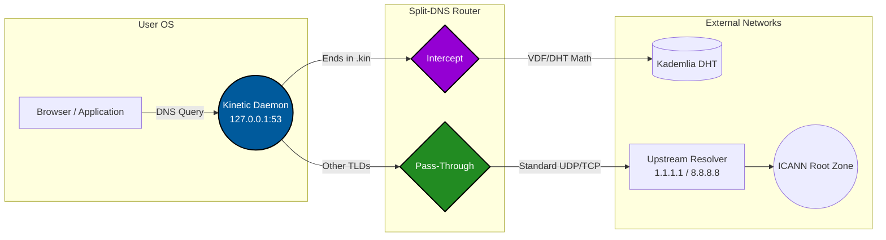

# ⚡ The Kinetic Protocol

*A stateless, Sybil-resistant naming system secured purely by math and time.*

Kinetic is a foundational network primitive designed to completely decouple human-meaningful handle allocation from both financial capital and physical identity. 

## 📖 Why We Built Kinetic

Current decentralized identity and naming architectures inevitably replicate the rent-seeking vulnerabilities of Web2 registry systems, creating an artificial economy of **digital landlordism**. To secure human-readable namespaces against Sybil attacks, existing protocols rely either on:
1. **Continuous capital allocation** (perpetual renewal fees) which prices out independent developers and favors wealthy speculators.
2. **Intrusive identity verification** (Proof of Personhood) which introduces severe onboarding friction and privacy concerns.

**Kinetic replaces monetary cost with sequential computational friction.** It establishes a self-cleaning namespace where mass-scale automated squatting becomes computationally and energetically ruinous, while remaining completely friction-free and zero-cost for a legitimate, solitary developer.

## 🏗️ How It Works (The Split-DNS Daemon)

To achieve native `.kin` resolution without relying on centralized top-level domain (TLD) authorities, Kinetic utilizes a lightweight background daemon that binds a local DNS proxy to the operating system's loopback interface.

## 📚 The Whitepaper

The complete architectural theory, mechanics, and cryptographic proofs are documented in the **[Kinetic Whitepaper](./whitepaper/kinetic.md)**. 

The whitepaper details our solutions to critical decentralized naming vulnerabilities, including:
*   **The Front-running Fix:** Clockless, sequential VDF linking anchored to a `drand` beacon.
*   **The Dictionary Squatting Fix:** Dynamic difficulty scaling via Verifiable Delay Functions.
*   **The Vacation Problem Fix:** A Hybrid Lease System combining Grace-Period Escalation and Hibernation VDFs.
*   **The Spam Fix:** Competitive Gossip and connection-level Hashcash Proof-of-Work.

## 🤝 Contributing

We welcome contributions from cryptographers, distributed systems engineers, and open-source enthusiasts. If you are interested in building the stateless future of the internet, please read the whitepaper and open an issue or pull request. We value rigorous debate, mathematical proof, and clean architecture.

## 📄 License

This project operates under a dual-license structure:
* **Codebase:** Licensed under the **[Apache License 2.0](LICENSE)**.
* **Whitepaper & Documentation:** The contents of the `whitepaper/` directory are licensed under **[CC BY-ND 4.0](./whitepaper/LICENSE)** (Attribution-NoDerivatives 4.0 International). This allows anyone to freely share the whitepaper, but legally prevents them from modifying, remixing, or altering the text and distributing it as their own.
