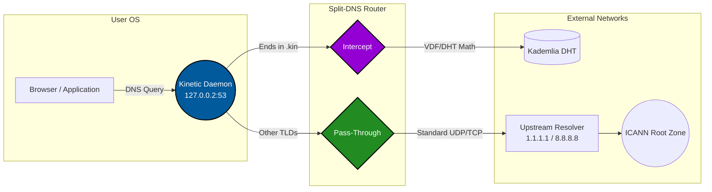

# ⚡ The Kinetic Protocol

[](https://opensource.org/licenses/Apache-2.0)
[](https://kinetic.saifmukhtar.dev)
[](https://www.rust-lang.org)
[]()
[](https://github.com/sponsors/saifmukhtar)

*A stateless, Sybil-resistant naming system secured purely by math and time.*

<div align="center">
  <video src="./kinetic-demo.mp4" controls="controls" muted="muted" style="max-width: 100%; border-radius: 8px;"></video>
  <br/>
  <i>Watch the 50-node Kinetic Network live simulation in action</i>
</div>

Kinetic is a fundamentally new paradigm for internet identity and domain resolution. It replaces the centralized registrars of DNS and the perpetual rent-seeking fees of blockchain-based naming systems (like ENS) with sequential computational friction (Verifiable Delay Functions). 

If you are a lone developer, registering a `.kin` domain is completely **free and permanent**. If you are a squatter trying to steal 10,000 domains, it will computationally bankrupt you.

### ✨ Key Features
- **Zero Blockchains, Zero Fees:** No gas, no tokens, no renewal fees. Ever.
- **VDF Proof-of-Time:** Secures names against front-running and theft using Chia's repeated squarings ($x^{2^T}$) anchored to the global `drand` beacon, rigorously hardened against concurrency and edge-case exploits.
- **Immunological DHT:** A highly adversarial, 64KB-limited Kademlia DHT that natively rejects poisoned records and resolves conflicts via XOR tie-breaking.
- **Split-DNS Magic:** Seamlessly intercepts `.kin` domains at the OS loopback level without breaking your standard internet traffic.
- **Mobile Delegation:** Smartphones securely hold your keys while delegating the heavy math to your Desktop via Nostr (NIP-04).

---

## 🚀 Quick Start

You can install the compiled Kinetic Daemon and integrate it into your system DNS with a single command. The installer safely integrates with your OS (`systemd-resolved` on Linux, `/etc/resolver` on macOS, NRPT on Windows).

**macOS & Linux:**
```bash
curl -sL https://raw.githubusercontent.com/saifmukhtar/kinetic/main/scripts/install.sh | bash
```

**Windows (PowerShell as Admin):**
```powershell
Invoke-WebRequest -Uri "https://raw.githubusercontent.com/saifmukhtar/kinetic/main/scripts/install.ps1" -OutFile "install.ps1"; .\install.ps1
```

### 🖥️ The Kinetic Web UI
The installation automatically includes the **Kinetic UI**, an embedded React interface that lets you monitor the network, manage your domains, and track P2P activity. Recent updates include a comprehensive real-time dashboard, detailed domain view management, and an advanced settings panel. Once the daemon is running, simply navigate to:

👉 **[http://localhost:16002](http://localhost:16002)**

---

## ⚙️ Claiming Your Name (The Two-Phase Workflow)

Kinetic secures names against front-running using a cryptographic **Two-Phase Commit/Reveal Protocol**. 

### 1. The Commit Phase
To claim a `.kin` domain, use the `register` command. This fetches randomness from the global `drand` beacon, broadcasts a secure Hash Commitment to the DHT (blinding sniper bots), and begins the sequential VDF calculation (Proof-of-Time) on your local CPU.
```bash
kinetic-cli register myname.kin
```
*Depending on the name's length, this will max out a CPU core for seconds, minutes, or hours.*

### 2. Configure Your Zone
Once the math finishes, Kinetic generates a template file at `~/.config/kinetic/zones/myname.kin.reveal.json`. Open this file and configure your target:
```json
{
  "name": "myname.kin.",
  "target_kid": "did:kin:kid1abc9f7...", // Resolves to your KID or a direct IP
  "vdf_proof": "..."
}
```

### 3. The Reveal Phase
Push your finished proof and DNS records to the global network:
```bash
kinetic-cli publish myname.kin
```
Your name is instantly live globally! Any device running Kinetic can now visit `http://myname.kin`.

---

## 🧪 Testing & Modular Architecture

Kinetic employs a highly decoupled, modular architecture backed by comprehensive inline and integration testing. Rather than monolithic event loops, every crate (`kinetic-network`, `kinetic-daemon`, `kinetic-node`) separates core logic, handlers, and cryptographic verification into distinct boundaries. 

The protocol is heavily guarded by extensive edge-case testing suites (e.g., `api_tests.rs`, `proxy_tests.rs`, `test_014_edge_cases.rs`), cross-crate `e2e` scripts, and deterministic storage fuzzing, ensuring the cryptographic layers remain completely impervious to malformed Kademlia payloads and hostile environments.

---

## 🌐 The Kinetic Simulation (50-Node Sandbox)

We have built a comprehensive, 50-container local simulation environment to demonstrate and red-team the protocol under real-world networking conditions. 

Located in the **[`kinetic-sim/`](./kinetic-sim/)** directory, this sandbox orchestrates:
- **10 DHT Nodes** (The core Kademlia network)
- **6 CDN Hosts** (Decentralized web hosts providing capacity)
- **34 AI-Driven User Daemons** (Simulated humans attempting to register domains and host websites)

The simulation includes a beautiful **Live Dashboard** built with React/Vite that lets you watch the Daemons compute VDFs, handle naming conflicts, seamlessly failover domains, and negotiate hosting in real time. 

👉 **[Read the Full Simulation Guide Here](./kinetic-sim/README.md)**

---

## 🏗️ Architecture

Because the browser speaks standard DNS and the `kinetic-daemon` speaks standard DNS, the browser has absolutely no idea that it just resolved a domain via a decentralized Kademlia swarm. The integration is seamless.


```mermaid
graph LR
    subgraph User OS
        App[Browser / Application]
        Daemon((Kinetic Daemon<br/>127.0.0.2:53))
        App -->|DNS Query| Daemon
    end

    subgraph Split-DNS Router
        Daemon -->|Ends in .kin| Kin{Intercept}
        Daemon -->|Other TLDs| Pass{Pass-Through}
    end

    subgraph External Networks
        Kin -->|VDF/DHT Math| DHT[(Kademlia DHT)]
        Pass -->|Standard UDP/TCP| Upstream[Upstream Resolver<br/>1.1.1.1 / 8.8.8.8]
        Upstream --> ICANN((ICANN Root Zone))
    end
    
    style Daemon fill:#005A9C,stroke:#000,stroke-width:2px,color:#fff
    style Kin fill:#9400D3,stroke:#000,stroke-width:2px,color:#fff
    style Pass fill:#228B22,stroke:#000,stroke-width:2px,color:#fff
```
*The Kinetic Daemon acts as a transparent intermediary, hijacking only `.kin` requests to resolve via the Kademlia DHT while seamlessly passing all standard internet traffic upstream.*

### Kinetic Identity Architecture (KID)
A core pillar of Kinetic v2 is the **Kinetic Identity Architecture (KID)**. Rather than simply mapping human-readable names to IP addresses, Kinetic names map to cryptographic identities (KIDs). These KIDs subsequently map to service manifests, transforming Kinetic from a simple decentralized domain system into a foundational identity-centric service discovery layer for the internet.

### Internal Crate Architecture
The Kinetic protocol is composed of several specialized Rust crates and external repositories:
*   **`kinetic-node`**: A headless infrastructure node optimized for cloud environments. It uses static keys to bypass Sybil PoW, runs purely in FullNode mode with disabled mDNS, and serves a Health-check API (`/health`) on port 16003.
*   **`kinetic-keygen`**: A deterministic offline key generator for Kinetic governance. Derived from BIP-39 mnemonic seeds via PBKDF2 to establish mathematical independence for `ROOT` and `GUARD` keys.
*   **`kinetic-kid`**: The core implementation of the Kinetic Identity Document architecture, handling cryptographic verification of service manifests and DID operations.
*   **`kinetic-storage`**: A robust wrapper around the `sled` embedded database, handling critical high-performance local state, including advanced auto-recovery logic (`.corrupt.bak` renaming) to survive crashes.
*   **`kinetic-client`**: The official cross-platform mobile application built in Flutter. It interfaces securely with the Rust core via FFI (`kinetic-ffi`) using dynamic Axum proxies for WebView interception. (Hosted in a separate repository: [saifmukhtar/kinetic-client](https://github.com/saifmukhtar/kinetic-client)).

## 📖 Official Documentation
Everything you need to know about Kinetic, the VDF math, and how to build on the network is available at the official docs:
**[https://kinetic.saifmukhtar.dev](https://kinetic.saifmukhtar.dev)**

- **[Kinetic Protocol Specification v2](https://kinetic.saifmukhtar.dev/protocol_specification.html)**: State machines, payload schemas, and empirical algorithms.
- **[The Kinetic Architecture (Network Layer)](https://kinetic.saifmukhtar.dev/network_architecture.html)**: The math behind the stateless routing protocol.
- **[Kinetic Adversarial Analysis](https://kinetic.saifmukhtar.dev/adversarial_analysis.html)**: Red-team audit of the cryptographic resilience.

---

## 🙏 Acknowledgments & Core Technologies

Kinetic stands on the shoulders of absolute giants. This protocol would not be possible without the foundational research and incredible engineering of the following open-source projects:

* **[rust-libp2p](https://github.com/libp2p/rust-libp2p):** The beating heart of our P2P network. We heavily utilize their Kademlia routing implementation, adapting it into our Immunological DHT.
* **[The Chia Network (VDFs)](https://github.com/Chia-Network/chiavdf):** We rely on Chia's highly optimized C++ implementation of Verifiable Delay Functions (Class Groups of Unknown Order) to generate our Proof-of-Time.
* **[drand](https://drand.love/):** The distributed randomness beacon. We use drand pulses as the cryptographically secure, unbiasable time-anchors for our Commit phase and Heartbeat tracking.
* **[Sled](https://github.com/spacejam/sled):** The lightning-fast, embedded key-value store we use to ensure the Daemon survives reboots and maintains your Heartbeats perfectly.
* **[Nostr (NIP-04)](https://github.com/nostr-protocol/nips):** We utilize Nostr encrypted direct messages to facilitate our Mobile VDF Delegation pipeline.

Created and maintained by Saif Mukhtar: **[https://saifmukhtar.dev](https://saifmukhtar.dev)**

## 📄 License

This project operates under a dual-license structure:
* **Codebase:** Licensed under the **[Apache License 2.0](LICENSE)**.
* **Whitepaper & Documentation:** Licensed under **[CC BY 4.0](./docs/LICENSE)**.
