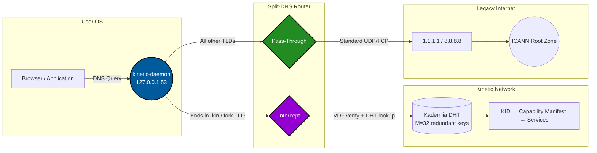

<div align="center">
  
  <h1>⚡ The Kinetic Protocol</h1>
  <p><strong>An open-source, forkable sovereign namespace engine secured by math and time.</strong></p>
  <p>
    <a href="https://opensource.org/licenses/Apache-2.0"></a>
    <a href="https://kinetic.saifmukhtar.dev"></a>
    <a href="https://www.rust-lang.org"></a>
    <a href=""></a>
    <a href="https://www.ietf.org/archive/id/draft-mukhtar-kinetic-network-00.html"></a>
    <a href="https://github.com/sponsors/saifmukhtar"></a>
  </p>
</div>

---

## What is Kinetic?

Kinetic is an **open-source namespace engine** written in Rust. Any university, company, government, or community can fork it, configure one file (`network.json`), and deploy a complete sovereign naming network — with their own TLD, their own bootstrap nodes, and their own governance keys.

The canonical public deployment of this engine is the **`.kin` network** — a permissionless global commons where no single entity holds administrative authority.

**The engine is the product. `.kin` is the proof it works.**

---

## Two Ways to Use This Repo

| | 🍴 Fork Your Own Network | 🌐 Use the `.kin` Network |
|---|---|---|
| **Who** | Universities, companies, governments | Developers, open-source builders |
| **Your TLD** | Whatever you want (`.uni`, `.acme`, `.internal`) | `.kin` |
| **Control** | You hold governance keys. You can reset. | No operator. Math governs it. |
| **Squatters** | VDF cliff + you can restart the network | VDF cliff alone |
| **Start here** | [`kinetic-forge` guide →](#-fork-your-own-network) | [Quick Start →](#-quick-start-kin-network) |

---

## Why This Had to Be Built

Every previous attempt at decentralized naming failed at the same problem: **what stops someone from squatting every name before real users arrive?**

The three existing answers all have fatal flaws:

- **Central authority (ICANN)** → political seizure, monopoly rent, domain parking markets
- **Financial capital (ENS, Handshake)** → digital landlordism, cryptocurrency price volatility, developer pricing-out
- **Proof of Personhood (Worldcoin et al.)** → retina scans, no pseudonymity, no multiple aliases

Kinetic uses a fourth answer: **un-parallelizable sequential computation.**

A Verifiable Delay Function (VDF) is a puzzle that:
- Takes a provably specific amount of real time to solve
- **Cannot be parallelized** — a billion-dollar ASIC farm cannot solve it faster than a laptop
- Produces a compact proof anyone can verify in milliseconds

The result: mass squatting is **physically impossible at scale**. A single CPU cannot claim more than a handful of 6-character names per year. A single legitimate developer registering one name pays **zero dollars and ~30 minutes of CPU**.

---

## 🍴 Fork Your Own Network

Kinetic's entire network identity lives in one file:

```json
// network.json — configure this, recompile, distribute
{
  "tld": "uni",
  "tld_suffix": ".uni",
  "did_prefix": "did:uni:",
  "network_id": "university-net",
  "benchmark_base_iterations": 238819830,
  "steal_target_rounds": 7884000,
  "m_redundancy": 16,
  "bootstrap_nodes": [
    "/ip4/YOUR_IP/tcp/6070/p2p/YOUR_PEER_ID"
  ]
}
```

`build.rs` compiles every field into compiled constants — no runtime config drift, no misconfigured nodes. Run `kinetic-forge` and walk away with a complete network:

```bash
cargo run --bin kinetic-forge
# Interactive wizard: sets TLD, benchmarks your hardware, generates governance keys
# Output: network.json + ./keys/root.key + ./keys/guard.key

cargo build --release --workspace
# Every binary now has your network's constants baked in
```

**Everything is swappable.** The engine defines abstract traits — swap out the backend at compile time without touching anything else:

| Component | Default | Swap When |
|---|---|---|
| `VdfEngine` | `ChiaVdfEngine` (C++ Class Groups) | Mobile/WASM, RSA-based VDF, research construction |
| `StorageEngine` | `SledStorage` (pure-Rust B-tree) | RocksDB, SQLite, distributed etcd, IoT constrained |

→ **[Full fork guide and `network.json` reference](https://kinetic.saifmukhtar.dev/forking.html)**

---

## 🚀 Quick Start (`.kin` Network)

```bash
# Prerequisites: Rust toolchain + build-essential + libgmp-dev
git clone https://github.com/saifmukhtar/kinetic.git
cd kinetic
cargo build --release

# Launch the daemon (intercepts .kin DNS at loopback, passes everything else through)
sudo ./target/release/kinetic-daemon

# Register a name — zero cost, two-phase commit/reveal
./target/release/kinetic-cli register myname.kin
# → Fetches drand randomness, broadcasts blind commitment, grinds VDF on your CPU
# → Saves proof to ~/.config/kinetic/zones/myname.kin.reveal.json

# Publish to the global DHT
./target/release/kinetic-cli publish myname.kin

# Test it
dig @127.0.0.1 myname.kin A
# → Your browser can now open http://myname.kin directly. No extension needed.
```

Dashboard at **[http://localhost:16001](http://localhost:16001)** — DHT peer map, VDF progress, heartbeat status.

---

## 🏗️ Architecture


```mermaid
graph LR
    subgraph User OS
        App[Browser / Application]
        Daemon((kinetic-daemon\n127.0.0.1:53))
        App -->|DNS Query| Daemon
    end

    subgraph Split-DNS Router
        Daemon -->|Ends in .kin / fork TLD| Intercept{Intercept}
        Daemon -->|All other TLDs| Pass{Pass-Through}
    end

    subgraph Kinetic Network
        Intercept -->|VDF verify + DHT lookup| DHT[(Kademlia DHT\nM=32 redundant keys)]
        DHT --> KID[KID → Capability Manifest → Services]
    end

    subgraph Legacy Internet
        Pass -->|Standard UDP/TCP| Upstream[1.1.1.1 / 8.8.8.8]
        Upstream --> ICANN((ICANN Root Zone))
    end

    style Daemon fill:#005A9C,stroke:#000,stroke-width:2px,color:#fff
    style Intercept fill:#9400D3,stroke:#000,stroke-width:2px,color:#fff
    style Pass fill:#228B22,stroke:#000,stroke-width:2px,color:#fff
```

### Crate Map

| Crate | Role |
|---|---|
| `kinetic-core` | Protocol types, VDF math, consensus constants (compiled from `network.json`) |
| `kinetic-network` | libp2p Kademlia DHT, Competitive Gossip validation, Eclipse defense |
| `kinetic-vdf` | `ChiaVdfEngine` — C++ chiavdf FFI + Wesolowski proof generation |
| `kinetic-storage` | `SledStorage` — ACID embedded B-tree, WASM in-memory fallback |
| `kinetic-daemon` | User-facing daemon: Split-DNS + embedded React UI + REST API |
| `kinetic-node` | Headless infrastructure node optimized for cloud |
| `kinetic-host` | Epoch-Bound transport identity, DoS defense, CDN host layer |
| `kinetic-kid` | KID document parsing, Capability Manifest verification |
| `kinetic-forge` | Interactive network configuration wizard |
| `kinetic-keygen` | Deterministic offline governance key generator |
| `kinetic-sim` | 50-node local simulation sandbox |

---

## 🔐 The Four-Layer Identity Stack

Kinetic resolves names into **cryptographic identities**, not IP addresses:

```
example.kin               ← Human-readable alias (transferable, ephemeral)
    ↓
did:kin:kid1abc9f7...      ← Permanent KID (Ed25519 keypair, non-transferable)
    ↓
Capability Manifest        ← Signed map of what services this identity exposes
    ↓
website / API / relay / ...← Actual content (Kinetic doesn't host this)
```

If ownership transfers, the name points to a different KID. Recipients can detect transfers — semantic attacks (sending crypto to the new owner thinking it's the old one) are impossible.

---

## 🔒 Security Properties

| Property | Mechanism |
|---|---|
| **Squatter resistance** | VDF difficulty cliff: 1-char name ≈ 100 years, 6-char ≈ 12 hours |
| **Front-running protection** | Two-phase Commit/Reveal — blind commitment before VDF starts |
| **Eclipse attack defense** | `M_REDUNDANCY=32` independent DHT keys × k=20 Kademlia peers = 640 storage slots per name |
| **Theft protection** | Quadratic decay: active names are cryptographically impossible to steal |
| **Sybil resistance** | VDF cannot be parallelized — no advantage from additional hardware |
| **Censorship resistance** | Split-DNS loopback: ISP cannot intercept `.kin` queries |

---

## 📖 Documentation & Whitepapers

| Resource | Link |
|---|---|
| **Full Docs** | [kinetic.saifmukhtar.dev](https://kinetic.saifmukhtar.dev) |
| **Fork Guide** | [forking.html](https://kinetic.saifmukhtar.dev/forking.html) |
| **Protocol Spec v2** | [protocol_specification.html](https://kinetic.saifmukhtar.dev/protocol_specification.html) |
| **Network Architecture** | [network_architecture.html](https://kinetic.saifmukhtar.dev/network_architecture.html) |
| **Adversarial Analysis** | [adversarial_analysis.html](https://kinetic.saifmukhtar.dev/adversarial_analysis.html) |
| **IETF Draft (Network)** | [draft-mukhtar-kinetic-network-00](https://www.ietf.org/archive/id/draft-mukhtar-kinetic-network-00.html) |
| **IETF Draft (Identity)** | [draft-mukhtar-kinetic-identity-00](https://www.ietf.org/archive/id/draft-mukhtar-kinetic-identity-00.html) |
| **Vision Whitepaper** | [`whitepaper/kinetic-vision.md`](./whitepaper/kinetic-vision.md) |
| **Consensus Paper** | [`whitepaper/kinetic-consensus.md`](./whitepaper/kinetic-consensus.md) |
| **Security Paper** | [`whitepaper/kinetic-security.md`](./whitepaper/kinetic-security.md) |
| **Governance Paper** | [`whitepaper/kinetic-governance.md`](./whitepaper/kinetic-governance.md) |

---

## 🌐 The Simulation Sandbox

`kinetic-sim/` contains a 50-container local simulation orchestrating:
- **10 DHT infrastructure nodes**
- **6 CDN hosts** with Epoch-Bound transport identity
- **34 AI-driven user daemons** that register, resolve, and heartbeat names

Used to red-team the protocol under real networking conditions.

```bash
cd kinetic-sim && docker compose up
# Dashboard: http://localhost:16001
```

→ **[Full simulation guide](./kinetic-sim/README.md)**

---

## 🙏 Built On

| Dependency | Role |
|---|---|
| [rust-libp2p](https://github.com/libp2p/rust-libp2p) | Kademlia DHT, Gossipsub, libp2p-stream |
| [chiavdf (Chia Network)](https://github.com/Chia-Network/chiavdf) | C++ VDF engine — Class Groups of Imaginary Quadratic Fields, Wesolowski proofs |
| [drand Quicknet](https://drand.love/) | Distributed randomness beacon (3-second pulse, no trusted setup) |
| [sled](https://github.com/spacejam/sled) | Pure-Rust embedded B-tree database |
| [Nostr NIP-04](https://github.com/nostr-protocol/nips) | Encrypted mobile VDF delegation channel |

---

## 📄 License

- **Codebase:** [Apache License 2.0](LICENSE)
- **Whitepapers & Documentation:** [CC BY 4.0](./docs/LICENSE)

---

*Created by [Saif Mukhtar](https://saifmukhtar.dev)*
