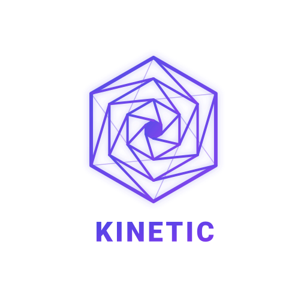
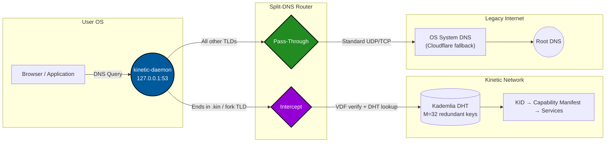

<div align="center">
  
  <h1>⚡ The Kinetic Protocol</h1>
  <p><strong>An open-source, forkable sovereign namespace engine secured by math and time.</strong></p>
  <p>
    <a href="https://opensource.org/licenses/Apache-2.0"></a>
    <a href="https://kinetic.saifmukhtar.dev"></a>
    <a href="https://www.rust-lang.org"></a>
    <a href=""></a>
    <a href="https://www.ietf.org/archive/id/draft-mukhtar-kinetic-network-00.html"></a>
    <a href="https://github.com/sponsors/saifmukhtar"></a>
  </p>
</div>

---

## What is Kinetic?

Kinetic is an **open-source namespace engine** written in Rust. Any university, company, government, or community can fork it, configure one file (`network.json`), and deploy a complete sovereign naming network — with their own TLD, their own bootstrap nodes, and their own governance keys.

The canonical public deployment of this engine is the **`.kin` network** — a permissionless global commons where no single entity holds administrative authority.

**The engine is the product. `.kin` is the proof it works.**

---

## Two Ways to Use This Repo

| | 🍴 Fork Your Own Network | 🌐 Use the `.kin` Network |
|---|---|---|
| **Who** | Universities, companies, governments, communities | Developers, open-source builders |
| **Your TLD** | Whatever you want (`.uni`, `.acme`, `.internal`) | `.kin` |
| **Control** | You hold governance keys. You can reset. | No operator. Math governs it. |
| **Squatters** | VDF cliff + operator can restart the network | VDF cliff alone |
| **Start here** | [Fork Guide →](#-fork-your-own-network) | [Quick Start →](#-quick-start-kin-network) |

---

## Why This Had to Be Built

Every previous approach to decentralized naming failed at the same problem: **what stops someone from registering every valuable name before real users arrive?**

Three patterns have been tried. All three have fatal flaws:

- **Central authority** — the registry can seize, censor, or price-gouge. Developers lease land from a sovereign.
- **Financial capital** — wealthy actors hoard short names and extract rent from builders. Digital landlordism, decentralized edition.
- **Biometric identity** — retina scans, video ceremonies, no pseudonymity, no multiple aliases. Infrastructure that demands your face.

Kinetic uses a fourth answer: **un-parallelizable sequential computation.**

A Verifiable Delay Function (VDF) is a mathematical puzzle that:
- Takes a provably specific amount of real time to solve
- **Cannot be parallelized** — a billion-dollar server farm cannot solve a single VDF faster than a laptop
- Produces a compact proof anyone can verify in milliseconds

The result: mass squatting is **physically impossible at scale**. A single CPU cannot claim more than a handful of 6-character names per year. A legitimate developer registering one name pays **zero dollars and ~30 minutes of CPU**.

---

## 🍴 Fork Your Own Network

Kinetic's entire network identity lives in one file:

```json
{
  "tld": "uni",
  "tld_suffix": ".uni",
  "did_prefix": "did:uni:",
  "network_id": "university-net",
  "benchmark_base_iterations": 238819830,
  "steal_target_rounds": 7884000,
  "m_redundancy": 16,
  "bootstrap_nodes": [
    "/ip4/YOUR_IP/tcp/6070/p2p/YOUR_PEER_ID"
  ]
}
```

`build.rs` compiles every field directly into the binaries as constants — no runtime config drift, no misconfigured nodes. Run `kinetic-forge` and walk away with a complete network:

```bash
cargo run --bin kinetic-forge
# Interactive wizard: sets TLD, benchmarks hardware, generates governance keys
# Output: network.json + ./keys/root.key + ./keys/guard.key

cargo build --release --workspace
# Every binary now has your network's constants baked in
```

**Everything is swappable at compile time** via abstract traits in `kinetic-core`:

| Component | Default | Swap when |
|---|---|---|
| `VdfEngine` | `ChiaVdfEngine` — C++ Class Groups, Wesolowski proofs | Mobile/WASM, RSA-based VDF, custom research construction |
| `StorageEngine` | `SledStorage` — pure-Rust embedded B-tree | RocksDB, SQLite, distributed etcd, IoT constrained environments |
| `GovernanceEngine` | `BicameralEngine` — Republic with Founder -> Council transition | `MonarchyEngine` (dictatorship), `CouncilEngine` (pure democracy), `AnarchyEngine` (immutable) |

→ **[Full fork guide and `network.json` reference](https://kinetic.saifmukhtar.dev/forking.html)**

---

## 🚀 Quick Start (`.kin` Network)

**macOS & Linux:**
```bash
curl -sL https://kinetic.saifmukhtar.dev/install.sh | bash
```

**Windows (PowerShell as Admin):**
```powershell
Invoke-WebRequest -Uri "https://kinetic.saifmukhtar.dev/install.ps1" -OutFile "install.ps1"; .\install.ps1
```

The installer downloads prebuilt binaries from GitHub Releases, sets up your system DNS (`systemd-resolved` on Linux, `/etc/resolver` on macOS, NRPT on Windows), and gets you running in minutes.

Once installed, register your first name:

```bash
# Register — zero cost, two-phase commit/reveal
kinetic register example.kin
# → Fetches drand randomness, broadcasts blind commitment, grinds VDF on your CPU

# Publish to the global DHT once VDF completes
kinetic publish example.kin

# Test resolution
dig @127.0.0.1 example.kin A
# → Open http://example.kin directly in your browser. No extension required.
```

---

## 🏗️ Architecture


```mermaid
graph LR
    subgraph "User OS"
        App["Browser / Application"]
        Daemon(("kinetic-daemon\n127.0.0.1:53"))
        App -->|DNS Query| Daemon
    end

    subgraph "Split-DNS Router"
        Daemon -->|"Ends in .kin / fork TLD"| Intercept{"Intercept"}
        Daemon -->|"All other TLDs"| Pass{"Pass-Through"}
    end

    subgraph "Kinetic Network"
        Intercept -->|"VDF verify + DHT lookup"| DHT[("Kademlia DHT\nM=32 redundant keys")]
        DHT --> KID["KID → Capability Manifest → Services"]
    end

    subgraph "Legacy Internet"
        Pass -->|"Standard UDP/TCP"| Upstream["OS System DNS\n(Cloudflare fallback)"]
        Upstream --> Root(("Root DNS"))
    end

    style Daemon fill:#005A9C,stroke:#000,stroke-width:2px,color:#fff
    style Intercept fill:#9400D3,stroke:#000,stroke-width:2px,color:#fff
    style Pass fill:#228B22,stroke:#000,stroke-width:2px,color:#fff
```

### Crate Map

| Crate | Role |
|---|---|
| `kinetic-core` | Protocol types, VDF math, consensus constants compiled from `network.json` |
| `kinetic-network` | libp2p Kademlia DHT, Competitive Gossip validation, Eclipse defense |
| `kinetic-vdf` | `ChiaVdfEngine` — C++ chiavdf FFI + Wesolowski proof generation |
| `kinetic-storage` | `SledStorage` — ACID embedded B-tree, WASM in-memory fallback |
| `kinetic-daemon` | User-facing daemon: Split-DNS loopback + REST API |
| `kinetic-node` | Headless infrastructure node for cloud deployments |
| `kinetic-host` | Epoch-Bound transport identity, DoS defense, CDN host layer |
| `kinetic-kid` | KID document parsing, Capability Manifest verification |
| `kinetic-forge` | Interactive network configuration wizard for fork operators |
| `kinetic-keygen` | Deterministic offline governance key generator |
| `kinetic-sim` | 50-node local simulation sandbox |

---

## 🔐 The Four-Layer Identity Stack

Kinetic resolves names into cryptographic identities, not IP addresses:

```
example.kin                  ← Human alias (transferable, ephemeral)
    ↓
did:kin:kid1abc9f7...         ← Permanent KID (Ed25519 keypair, non-transferable)
    ↓
Capability Manifest           ← Signed map of services this identity exposes
    ↓
website / API / relay / ...   ← Content (Kinetic routes — it does not host)
```

Name and identity are strictly separated. If ownership transfers, the name points to a different KID. Semantic attacks — sending to the new owner assuming they are the old one — are cryptographically detectable.

---

## 🔒 Security Properties

| Property | Mechanism |
|---|---|
| **Squatter resistance** | VDF difficulty cliff — 1-char ≈ 100 years, 6-char ≈ 12 hours, 8-char ≈ 2 hours |
| **Front-running protection** | Two-phase Commit/Reveal — blind commitment broadcast before VDF starts |
| **Eclipse attack defense** | `M_REDUNDANCY=32` independent DHT keys × k=20 Kademlia peers = 640 storage slots per name |
| **Theft protection** | Quadratic decay curve — active names are cryptographically impossible to steal |
| **Sybil resistance** | VDF cannot be parallelized — no advantage from additional hardware |
| **Censorship resistance** | Split-DNS loopback — ISP cannot intercept `.kin` queries |

---

## 🖥️ Client Ecosystem

Client apps live in **[saifmukhtar/kinetic-client](https://github.com/saifmukhtar/kinetic-client)**:

- **Desktop** — Tauri v2 + React native app (macOS, Linux, Windows)
- **Mobile** — Flutter app (Android, iOS) with Rust FFI via `flutter_rust_bridge`
- **Browser Extension** — Chrome / Firefox native `.kin` resolution

> The client ecosystem is under active development.

---

## 🌐 The Simulation Sandbox

`kinetic-sim/` contains a 50-container local simulation using **Podman** and **Containerlab**:

- **10 DHT infrastructure nodes**
- **6 CDN hosts** with Epoch-Bound transport identity
- **34 AI-driven user daemons** that register, resolve, and heartbeat names
- **Real-time dashboard** at `kinetic-sim/kinetic-dashboard/`

```bash
cd kinetic-sim

# Build images and deploy 50-node topology
./deploy.sh

# Start the orchestrator
sudo PYTHONPATH="$HOME/.local/lib/python3.14/site-packages" python3 orchestrator.py

# Start the dashboard (separate terminal)
cd kinetic-dashboard && npm install && npm run dev

# Teardown
sudo containerlab destroy -t topology.clab.yml --runtime podman
```

→ **[Full simulation guide](./kinetic-sim/README.md)**

---

## 👩‍💻 Building from Source

```bash
# Prerequisites
sudo apt install build-essential cmake libgmp-dev  # Ubuntu/Debian
brew install cmake gmp                              # macOS

git clone https://github.com/saifmukhtar/kinetic.git
cd kinetic
cargo build --release --workspace
```

> ⚠️ Always build in `--release`. The VDF computation is highly sensitive to compiler optimizations — debug mode makes name registrations unbearably slow.

---

## 📖 Documentation & Whitepapers

| Resource | Link |
|---|---|
| **Full Docs** | [kinetic.saifmukhtar.dev](https://kinetic.saifmukhtar.dev) |
| **Fork Guide** | [forking.html](https://kinetic.saifmukhtar.dev/forking.html) |
| **Protocol Spec v2** | [protocol_specification.html](https://kinetic.saifmukhtar.dev/protocol_specification.html) |
| **Network Architecture** | [network_architecture.html](https://kinetic.saifmukhtar.dev/network_architecture.html) |
| **Adversarial Analysis** | [adversarial_analysis.html](https://kinetic.saifmukhtar.dev/adversarial_analysis.html) |
| **IETF Draft (Network)** | [draft-mukhtar-kinetic-network-00](https://www.ietf.org/archive/id/draft-mukhtar-kinetic-network-00.html) |
| **IETF Draft (Identity)** | [draft-mukhtar-kinetic-identity-00](https://www.ietf.org/archive/id/draft-mukhtar-kinetic-identity-00.html) |
| **Vision Whitepaper** | [`whitepaper/kinetic-vision.md`](./whitepaper/kinetic-vision.md) |
| **Consensus Paper** | [`whitepaper/kinetic-consensus.md`](./whitepaper/kinetic-consensus.md) |
| **Security Paper** | [`whitepaper/kinetic-security.md`](./whitepaper/kinetic-security.md) |
| **Governance Paper** | [`whitepaper/kinetic-governance.md`](./whitepaper/kinetic-governance.md) |

---

## 🙏 Built On

| Dependency | Role |
|---|---|
| [rust-libp2p](https://github.com/libp2p/rust-libp2p) | Kademlia DHT, Gossipsub, libp2p-stream |
| [chiavdf (Chia Network)](https://github.com/Chia-Network/chiavdf) | C++ VDF engine — Class Groups of Imaginary Quadratic Fields, Wesolowski proofs |
| [drand Quicknet](https://drand.love/) | Distributed randomness beacon — 3-second pulse, no trusted setup |
| [sled](https://github.com/spacejam/sled) | Pure-Rust embedded B-tree database |
| [Nostr NIP-04](https://github.com/nostr-protocol/nips) | Encrypted mobile VDF delegation channel |

---

## 📄 License

- **Codebase:** [Apache License 2.0](LICENSE)
- **Whitepapers & Documentation:** [CC BY 4.0](./docs/LICENSE)

---

*Created by [Saif Mukhtar](https://saifmukhtar.dev)*
