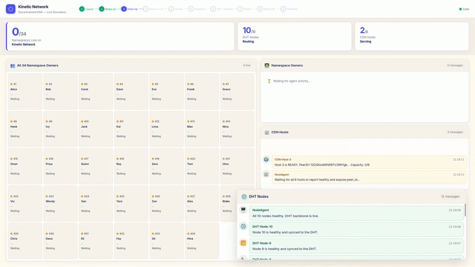
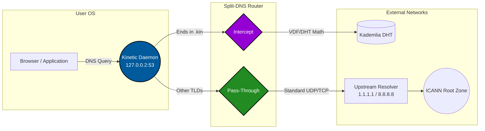

<div align="center">
  
  <h1>⚡ The Kinetic Protocol</h1>

[](https://opensource.org/licenses/Apache-2.0)
[](https://kinetic.saifmukhtar.dev)
[](https://www.rust-lang.org)
[]()
[](https://github.com/sponsors/saifmukhtar)
</div>

## What is Kinetic?

Kinetic is an experimental decentralized naming protocol written in Rust.

It explores using Verifiable Delay Functions (VDFs) instead of recurring registration fees to make name registration expensive for attackers but inexpensive for ordinary users.

The project is under active development and should currently be considered experimental.

## Why does it exist?

While building [Antimatter](https://github.com/saifmukhtar/antimatter), I realized that even though the core was fully decentralized, the application still depended on standard domains for initial peer-to-peer connections. That made me start thinking whether naming could work differently—without relying on centralized registrars or tying identity to expensive blockchain tokens. Kinetic is the result of exploring that question.

## 🚀 Quick Start

You can install the compiled Kinetic Daemon and integrate it into your system DNS with a single command. The installer safely integrates with your OS (`systemd-resolved` on Linux, `/etc/resolver` on macOS, NRPT on Windows).

**macOS & Linux:**
```bash
curl -sL https://kinetic.saifmukhtar.dev/install.sh | bash
```

**Windows (PowerShell as Admin):**
```powershell
Invoke-WebRequest -Uri "https://kinetic.saifmukhtar.dev/install.ps1" -OutFile "install.ps1"; .\install.ps1
```

### 🖥️ The Kinetic Web UI
The installation automatically includes the **Kinetic UI**, an embedded React interface that lets you monitor the network, manage your domains, and track P2P activity. Once the daemon is running, simply navigate to:

👉 **[http://localhost:16002](http://localhost:16002)**

<div align="center">
  
  <br/>
  <i>Watch the 50-node Kinetic Network live simulation in action</i>
</div>

## 🏗️ Architecture

Because the browser speaks standard DNS and the `kinetic-daemon` speaks standard DNS, the browser has no idea that it just resolved a domain via a decentralized Kademlia swarm. The integration is seamless.


```mermaid
graph LR
    subgraph User OS
        App[Browser / Application]
        Daemon((Kinetic Daemon<br/>127.0.0.2:53))
        App -->|DNS Query| Daemon
    end

    subgraph Split-DNS Router
        Daemon -->|Ends in .kin| Kin{Intercept}
        Daemon -->|Other TLDs| Pass{Pass-Through}
    end

    subgraph External Networks
        Kin -->|VDF/DHT Math| DHT[(Kademlia DHT)]
        Pass -->|Standard UDP/TCP| Upstream[Upstream Resolver<br/>1.1.1.1 / 8.8.8.8]
        Upstream --> ICANN((ICANN Root Zone))
    end
    
    style Daemon fill:#005A9C,stroke:#000,stroke-width:2px,color:#fff
    style Kin fill:#9400D3,stroke:#000,stroke-width:2px,color:#fff
    style Pass fill:#228B22,stroke:#000,stroke-width:2px,color:#fff
```

### Internal Crate Architecture
The Kinetic protocol is composed of specialized Rust crates:
*   **`kinetic-node`**: A headless infrastructure node optimized for cloud environments.
*   **`kinetic-keygen`**: A deterministic offline key generator for Kinetic governance.
*   **`kinetic-kid`**: Handles cryptographic verification of service manifests and Identity Document (KID) operations.
*   **`kinetic-storage`**: A wrapper around the `sled` embedded database, handling local state and auto-recovery.
*   **`kinetic-client`**: The cross-platform mobile application built in Flutter. (Hosted in [saifmukhtar/kinetic-client](https://github.com/saifmukhtar/kinetic-client)).

## ✨ Features

- **Zero Blockchains, Zero Fees:** No gas, no tokens, no renewal fees.
- **VDF Proof-of-Time:** Secures names against front-running and theft using Chia's repeated squarings ($x^{2^T}$) anchored to the global `drand` beacon.
- **Kademlia DHT:** A 64KB-limited Kademlia DHT that natively rejects poisoned records and resolves conflicts via XOR tie-breaking.
- **Split-DNS:** Seamlessly intercepts `.kin` domains at the OS loopback level without breaking standard internet traffic.
- **Mobile Delegation:** Smartphones securely hold your keys while delegating the heavy math to your Desktop via Nostr (NIP-04).

## ⚙️ Claiming Your Name (The Two-Phase Workflow)

Kinetic secures names against front-running using a **Two-Phase Commit/Reveal Protocol**. 

### 1. The Commit Phase
To claim a `.kin` domain, use the `register` command. This fetches randomness from the global `drand` beacon, broadcasts a secure Hash Commitment to the DHT, and begins the sequential VDF calculation (Proof-of-Time) on your local CPU.
```bash
kinetic-cli register myname.kin
```
*Depending on the name's length, this will max out a CPU core for seconds, minutes, or hours.*

### 2. Configure Your Zone
Once the math finishes, Kinetic generates a template file at `~/.config/kinetic/zones/myname.kin.reveal.json`. Open this file and configure your target:
```json
{
  "name": "myname.kin.",
  "target_kid": "did:kin:kid1abc9f7...",
  "vdf_proof": "..."
}
```

### 3. The Reveal Phase
Push your finished proof and DNS records to the global network:
```bash
kinetic-cli publish myname.kin
```
Your name is live globally. Any device running Kinetic can visit `http://myname.kin`.

## 📖 Official Documentation
Everything you need to know about Kinetic, the VDF math, and how to build on the network is available at the official docs:
**[https://kinetic.saifmukhtar.dev](https://kinetic.saifmukhtar.dev)**

- **[Kinetic Protocol Specification v2](https://kinetic.saifmukhtar.dev/protocol_specification.html)**: State machines, payload schemas, and empirical algorithms.
- **[The Kinetic Architecture (Network Layer)](https://kinetic.saifmukhtar.dev/network_architecture.html)**: The math behind the stateless routing protocol.
- **[Kinetic Adversarial Analysis](https://kinetic.saifmukhtar.dev/adversarial_analysis.html)**: Audit of the cryptographic resilience.

## 🌐 The Kinetic Simulation (50-Node Sandbox)

We have built a 50-container local simulation environment to demonstrate and red-team the protocol under real-world networking conditions. 

Located in the **[`kinetic-sim/`](./kinetic-sim/)** directory, this sandbox orchestrates:
- **10 DHT Nodes**
- **6 CDN Hosts**
- **34 AI-Driven User Daemons**

👉 **[Read the Full Simulation Guide Here](./kinetic-sim/README.md)**

## 🙏 Acknowledgments & Core Technologies

Kinetic relies on the foundational research and engineering of the following open-source projects:

* **[rust-libp2p](https://github.com/libp2p/rust-libp2p):** The core of our P2P network, utilizing their Kademlia routing implementation.
* **[The Chia Network (VDFs)](https://github.com/Chia-Network/chiavdf):** C++ implementation of Verifiable Delay Functions (Class Groups of Unknown Order).
* **[drand](https://drand.love/):** The distributed randomness beacon.
* **[Sled](https://github.com/spacejam/sled):** Embedded key-value store.
* **[Nostr (NIP-04)](https://github.com/nostr-protocol/nips):** Nostr encrypted direct messages for Mobile VDF Delegation.

Created and maintained by Saif Mukhtar: **[https://saifmukhtar.dev](https://saifmukhtar.dev)**

## 📄 License

This project operates under a dual-license structure:
* **Codebase:** Licensed under the **[Apache License 2.0](LICENSE)**.
* **Whitepaper & Documentation:** Licensed under **[CC BY 4.0](./docs/LICENSE)**.
