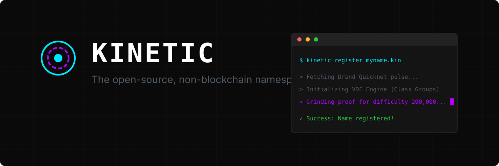
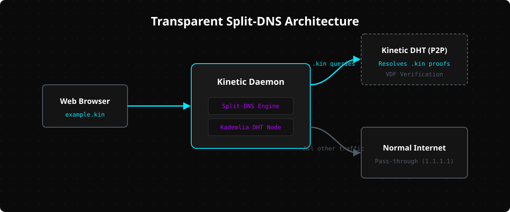

<div align="center">
  <picture>
    
  </picture>
  <p>
    <a href="https://opensource.org/licenses/Apache-2.0"></a>
    <a href="https://creativecommons.org/licenses/by/4.0/"></a>
    <a href="https://kinetic.saifmukhtar.dev"></a>
    <a href="https://www.rust-lang.org"></a>
    <a href="https://github.com/saifmukhtar/kinetic"></a>
  </p>
  <p>
    <a href="https://www.ietf.org/archive/id/draft-mukhtar-kinetic-network-00.html"></a>
    <a href="https://www.ietf.org/archive/id/draft-mukhtar-kinetic-identity-00.html"></a>
  </p>
</div>

---

### 🌐 [Official Website & Live Documentation](https://kinetic.saifmukhtar.dev) | 📜 [Read the Whitepapers](./whitepaper/kinetic-vision.md) | 🏛️ [Governance Specs](./.github/GOVERNANCE.md)

---

## ⚡ What is Kinetic?

**Kinetic** is a **decentralized, zero-cost, sovereign namespace and identity engine** written in Rust. It solves the domain naming problem without relying on centralized corporate registries (like ICANN) and without blockchains, gas fees, or speculative crypto tokens.

Instead of paying money to registrars, you pay with **sequential computational time**. By evaluating a **Verifiable Delay Function (VDF)** over imaginary quadratic class groups, your machine proves it expended un-parallelizable time to claim a name.

- 💎 **Zero Cost:** Domain registrations require exactly **$0.00**.
- 🛡️ **Squatter-Resistant:** Short names scale on a steep mathematical "Squatter Cliff" (a 2-char domain requires 30 days of CPU squarings; 21–63 char domains take 30 minutes). Mass domain squatting and bot sniper farms are physically impossible.
- 🔐 **Post-Quantum Ownership:** Names are cryptographically bound to an **ML-DSA-65 (FIPS 204)** quantum-resistant identity key.
- 🌍 **Native Split-DNS Interception:** Integrates transparently into your OS network stack, resolving `.kin` names natively in any Web2 browser while passing standard internet queries through unaffected.

---

## 🏗️ Architecture & How It Works

Kinetic acts as a local, transparent **Split-DNS gateway** running on port 53:

<div align="center">
  <picture>
    
  </picture>
</div>

1. **Query Interception:** When you type `alice.kin` into Firefox, Chrome, or `curl`, the OS resolver sends the request to the Kinetic Daemon listening on `127.0.0.2:53`.
2. **DHT Lookup:** The daemon checks its local Kademlia DHT routing table (`libp2p`) to resolve the zone payload signed by Alice's post-quantum key.
3. **Transparent Passthrough:** Standard internet queries (e.g. `google.com` or `github.com`) are immediately forwarded to your upstream OS resolver without latency overhead.

---

## 🌐 Quick Start — Use the `.kin` Network

The `.kin` network is the canonical public commons running on the Kinetic engine.

### 📥 1. Install via One-Line Script

**Linux & macOS:**
```bash
curl -sSL https://kinetic.saifmukhtar.dev/install.sh | bash
```

**Windows (PowerShell as Admin):**
```powershell
Set-ExecutionPolicy -Scope CurrentUser -ExecutionPolicy RemoteSigned
```
```powershell
irm https://kinetic.saifmukhtar.dev/install.ps1 | iex
```

---

### 🔑 2. Initialize Your Post-Quantum Identity

Generate your 24-word master seed phrase and post-quantum keys:

```bash
kinetic seed init
```

---

### 📝 3. Claim Your `.kin` Name

Compute the un-parallelizable VDF proof and publish your name to the global P2P network:

```bash
kinetic name register mywebsite.kin
```

Once the VDF proof completes, publish the zone record:

```bash
kinetic name publish mywebsite.kin
```

You can now visit `mywebsite.kin` natively in your browser or host services on it!

> 🖥️ **Prefer a Graphical GUI?** Try the cross-platform desktop application at [saifmukhtar/kinetic-client](https://github.com/saifmukhtar/kinetic-client).

---

## 🍴 Deploy Your Own Sovereign Network (`kinetic-forge`)

Kinetic is designed from the ground up to be fully engine-swappable and engine-forkable. Any university, enterprise, government, or private community can deploy their own independent, cryptographically isolated namespace (e.g., `.uni`, `.corp`, `.dev`) in minutes.

Using the interactive `kinetic-forge` wizard:

```bash
cargo run --release --bin kinetic-forge
```

1. **Configure Network Constants:** Define custom TLDs, bootstrap nodes, and target VDF delay parameters in `network.json`.
2. **Compile Engine:** Constants are compiled directly into the binary suite via `build.rs` for maximum performance and zero config drift.
3. **Governance:** Maintain sovereign governance keys with emergency timelocks and 69% maintenance council ratifications.

📖 **[Read the Complete Engine Forking & Custom Network Guide](https://kinetic.saifmukhtar.dev/vdf-calibration.html)**

---

## 💻 Building from Source

Kinetic requires **Rust 1.80+** and C++ build tools for the `chiavdf` FFI engine.

### 📦 Prerequisites

**Ubuntu / Debian:**
```bash
sudo apt update && sudo apt install -y build-essential cmake libgmp-dev
```

**macOS (Homebrew):**
```bash
brew install cmake gmp
```

### 🔨 Compilation

```bash
git clone https://github.com/saifmukhtar/kinetic.git
```
```bash
cd kinetic
```
```bash
cargo build --release --workspace
```

> ⚠️ **CRITICAL:** Always compile with `--release`. Debug builds lack compiler SIMD/LTO optimizations, making VDF squarings unplayably slow.

---

## 🧪 50-Node Simulation Sandbox

The repository includes an autonomous multi-node simulation environment (`kinetic-sim/`) testing network resiliency, DHT lookup, VDF anti-squatting, and CDN web hosting failovers across 50 containerized nodes.

```bash
cd kinetic-sim
```
```bash
python3 setup_sim.py
```
```bash
./deploy.sh
```

Run the Python orchestrator:
```bash
sudo python3 orchestrator.py
```

Launch the real-time visual web dashboard:
```bash
cd kinetic-dashboard && npm install && npm run dev
```

---

## 📚 Complete Whitepapers & Specifications

Explore the mathematical proofs, RFC drafts, and security models powering Kinetic:

### 📜 Official Whitepapers (`whitepaper/`)
- 📄 **[1. Vision & Executive Summary](./whitepaper/kinetic-vision.md):** The case for sovereign time-secured namespaces.
- ⚡ **[2. Consensus & Proof of Patience](./whitepaper/kinetic-consensus.md):** Squatter Cliff mathematical proofs & VDF class group squarings.
- 🆔 **[3. Decentralized Identity Architecture (KID)](./whitepaper/kinetic-identity.md):** Post-quantum ML-DSA-65 identity documents.
- 🌐 **[4. Network & Execution Spec](./whitepaper/kinetic-network.md):** libp2p Kademlia DHT, gossip subtopics, and Split-DNS.
- 🛡️ **[5. Security & Threat Mitigation](./whitepaper/kinetic-security.md):** Formal resistance to Sybil, Eclipse, and Front-Running attacks.
- 🏛️ **[6. Governance Engine](./whitepaper/kinetic-governance.md):** Council multisig rules and timelock emergency resets.
- 🔨 **[7. Kinetic Engine Forking (`kinetic-forge`)](./whitepaper/kinetic-forge.md):** Custom TLD network deployment guide.

### 📜 IETF Internet-Draft Specifications
- 📑 **[draft-mukhtar-kinetic-network-00](https://www.ietf.org/archive/id/draft-mukhtar-kinetic-network-00.html):** The Kinetic Network Protocol Specification.
- 📑 **[draft-mukhtar-kinetic-identity-00](https://www.ietf.org/archive/id/draft-mukhtar-kinetic-identity-00.html):** The Kinetic Identity (KID) Specification.

---

## 🏛️ Technical Specifications & Repository Guides (`.github/`)

- 🏗️ **[ARCHITECTURE.md](./.github/ARCHITECTURE.md):** Deep-dive workspace topology, binary boundaries, and trait abstractions.
- ⚙️ **[CONFIG.md](./.github/CONFIG.md):** Comprehensive configuration guide for daemon, P2P networking, and Drand settings.
- 🔐 **[CRYPTO.md](./.github/CRYPTO.md):** Cryptographic primitive choices (Ed25519, ML-DSA-65, Chia VDF, Drand).
- 🛡️ **[THREAT_MODEL.md](./.github/THREAT_MODEL.md):** Adversarial threat vectors, security boundaries, and non-goals.
- 🏛️ **[GOVERNANCE.md](./.github/GOVERNANCE.md):** Maintenance council supermajority, Council keys, and emergency procedure.
- 🤝 **[CONTRIBUTING.md](./.github/CONTRIBUTING.md):** Contribution guidelines, commit rules, and PR checklist.
- 🔒 **[SECURITY.md](./.github/SECURITY.md):** Responsible disclosure policy and security contacts.
- 📜 **[CODE_OF_CONDUCT.md](./.github/CODE_OF_CONDUCT.md):** Community engagement standards.

---

## 🛠️ Open-Source Foundation & Acknowledgments

Kinetic is built upon world-class open-source infrastructure:

- 🦀 **[rust-libp2p](https://github.com/libp2p/rust-libp2p):** Peer-to-peer networking, Kademlia DHT, Gossipsub, and NAT traversal.
- 🧮 **[chiavdf](https://github.com/Chia-Network/chiavdf):** High-speed Class Group VDF repeated squarings engine.
- 🎲 **[drand](https://drand.love/):** Ungameable threshold randomness beacon for VDF commitment challenges.
- ⚡ **[hickory-dns](https://github.com/hickory-dns/hickory-dns):** Sovereign Split-DNS server interception framework.
- 🔑 **[ml-dsa](https://github.com/RustCrypto/signatures/tree/master/ml-dsa):** FIPS 204 post-quantum digital signature algorithms.
- 💾 **[sled](https://github.com/spacejam/sled):** Embedded pure-Rust high-concurrency database.
- 🚀 **[axum](https://github.com/tokio-rs/axum):** Modern async web framework powering local daemon REST APIs.

---

<div align="center">
  <p><strong>Code License:</strong> <a href="LICENSE">Apache License 2.0</a> &nbsp;|&nbsp; <strong>Documentation & Specs:</strong> <a href="./docs/LICENSE">Creative Commons Attribution 4.0 International (CC BY 4.0)</a></p>
  <p><em>Created & Maintained by <a href="https://saifmukhtar.dev">Saif Mukhtar</a></em> &nbsp;•&nbsp; 🌐 <a href="https://kinetic.saifmukhtar.dev">kinetic.saifmukhtar.dev</a></p>
</div>
