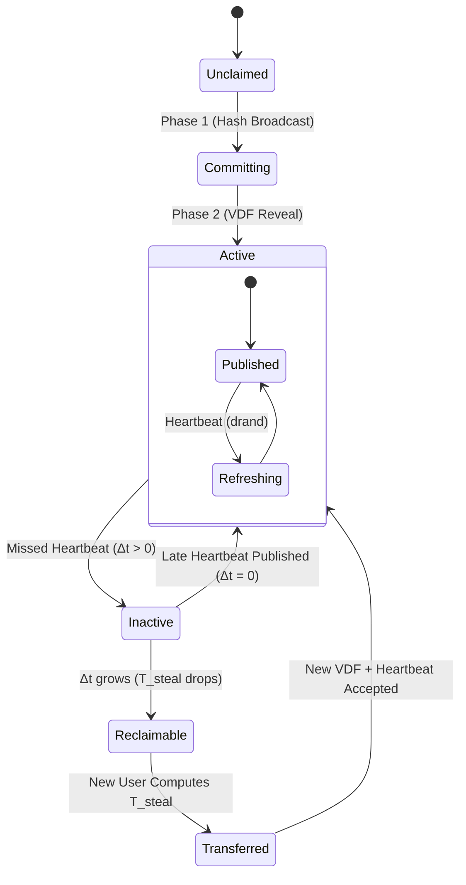

# Kinetic Protocol Specification v2
## A Decentralized, Identity-Centric Service Discovery Network

**Version 2.0 (Formal Specification)**

## Abstract
Kinetic is a completely decentralized protocol that maps human-readable names to cryptographic identities (KIDs), which in turn map to service manifests. Kinetic eliminates the need for blockchains, consensus algorithms, or trusted resolution authorities by strictly utilizing verifiable delay functions (VDFs), cryptographic signatures, and a Kademlia Distributed Hash Table (DHT).

This document serves as the formal architectural specification for the Kinetic protocol, encompassing the resolution lifecycle, data schemas, empirical proofs, and light-client operational models.

---

## 1. The Formal State Machine (Protocol V2)

Ownership of a Kinetic name is an ephemeral state defined purely by cryptographic mathematics, not by database registry entries. The state of any name traverses the following lifecycle:



### State Definitions
- **Unclaimed:** The name has never been registered. $T_{\text{steal}} = T_{\text{base}}$.
- **Committing:** A user has anchored a blind Hash Commitment to a `drand` pulse on the DHT.
- **Active:** A valid VDF `Reveal` was published, completing the Two-Phase Commit/Reveal.
- **Inactive:** The owner has failed to publish a recent heartbeat. $\Delta t > 0$.
- **Reclaimable:** The owner has been inactive long enough that $T_{\text{steal}}$ has decayed to a computationally feasible threshold for a challenger.
- **Transferred:** A challenger successfully computed the decayed $T_{\text{steal}}$ VDF and claimed the name.

---

## 2. Empirical Protocol Economics

Kinetic's security relies on the asymmetry of VDF verification and the Grace-Period Escalation curve. To formally prove the economic deterrents, empirical simulations were conducted.

### 2.1 The Escalation Curve ($D_{\text{steal}}$)
When a name becomes `Inactive`, the steal difficulty decays according to a **quadratic inverse** curve (as implemented in `kinetic-core/src/consensus_math.rs`):
$$ D_{\text{steal}}(\Delta r) = D_{\text{base}} \times \max\left(1,\ \frac{R_{\text{target}}^2}{(\Delta r + 1)^2}\right) $$
where $R_{\text{target}} = 7{,}884{,}000$ rounds (≈ 9 months at 3s/round on Quicknet) and $\Delta r$ is rounds elapsed since the last heartbeat.

| Idle Time | Multiplier | Interpretation |
|---|---|---|
| 0 rounds | $R_{\text{target}}^2$ | Near-infinite — theft impossible |
| 1 month ($\approx$876,000 rounds) | $\sim$81× | Extremely hard |
| 4.5 months ($\approx$3,942,000 rounds) | $\sim$4× | Hard |
| 9 months ($\approx$7,884,000 rounds) | $1\times$ (baseline) | Freely reclaimable |
| Beyond $R_{\text{target}}$ | $1\times$ | Name returned to commons |

**Conclusion:** Active names are mathematically impossible to steal. Abandoned names are cleanly recycled back to the commons after ≈9 months.

### 2.2 DHT Keyspace Dispersion (Eclipse Defense)
Kinetic stores `M_REDUNDANCY = 32` independent, deterministically derived keys per name (constant in `kinetic-core/src/types/domain.rs`). Each key is:
$$ K_i = \text{SHA256}(\text{name} \parallel i \parallel \texttt{"kinetic-dht-v1"}), \quad i \in \{0, 1, \ldots, 31\} $$
libp2p Kademlia then replicates each of the 32 keys to the $k=20$ closest peers by XOR distance, giving an effective storage redundancy of $32 \times 20 = 640$ independent storage locations per name.

Because SHA-256 acts as a random oracle, all 32 keys are statistically uncorrelated and uniformly distributed. An Eclipse attacker must simultaneously control nodes closest to all 32 derived keys — an attack requiring supermajority network control.

For an attacker controlling fraction $f=0.20$ with Kademlia bucket size $k=20$ and $M=32$ keys:
$$ P_{\text{eclipse}} = (f^k)^M = 0.2^{640} \approx 10^{-448} $$

**Conclusion:** Eclipsing a single name is physically impossible at any meaningful attacker scale.

---

## 3. Payload Schemas

Kinetic enforces **two payload size limits at two distinct layers**, both enforced in code:

| Layer | Limit | File | Purpose |
|---|---|---|---|
| Protocol (core) | **64 KB (65,536 bytes)** | `kinetic-core/src/types/vdf.rs` — `MAX_PAYLOAD_SIZE` | Authoritative protocol limit. `Reveal::validate()` rejects any payload exceeding this at the consensus layer. |
| Transport (network) | **8,000 bytes** | `kinetic-network/src/client/core.rs` | Tighter P2P gossip guard. Rejects oversized payloads before they reach the DHT, preventing gossip exhaustion attacks. |

In practice, the **8,000-byte transport limit** is the operative constraint for published payloads. The 64KB limit exists as the protocol-level ceiling for future extensions (e.g., TLSA records, IPFS CIDs).

### 3.1 The Reveal Struct (Protocol Version 2)
The core cryptographic truth that proves a user owns a name, finalizing the Two-Phase Commit.

```json
{
  "protocol_version": 2,
  "name": "example.kin",
  "payload": [ 123, 34, ... ], // Contains serialized DnsZone
  "salt": [ 0, 1, 2, ... ], // 32 bytes
  "drand_pulse": 29970036,
  "drand_randomness": "e66884daaefd...",
  "iterations": 4194304,
  "vdf_proof": {
    "proof_bytes": [ 5, 89, ... ]
  },
  "pubkey": [ 1, 2, 3, ... ], // 32 bytes Ed25519
  "signature": [ 4, 5, 6, ... ] // 64 bytes
}
```

### 3.2 The Kinetic Identity Document (KID)
The permanent semantic anchor of the user. To prevent spam, KIDs must be serialized using **Canonical JSON Serialization (JCS)** and require a **20-bit Hashcash Proof-of-Work (PoW)**.

```json
{
  "kid": "did:kin:ed25519-abc123def456...",
  "rotation_keys": ["ed25519-xyz987..."],
  "manifest_hash": "sha256-456def...",
  "pow_nonce": 8493021,
  "signature": "sig-kid-abc..."
}
```

### 3.3 The Capability Manifest
The mapping of the Identity to concrete services. Also requires a 20-bit Hashcash PoW.

```json
{
  "services": {
    "website": {
      "type": "ipv4",
      "endpoint": "198.51.100.14"
    },
    "api": {
      "type": "grpc",
      "endpoint": "api.example.org:443"
    },
    "nostr": {
      "type": "websocket",
      "endpoint": "wss://relay.kinetic.network"
    }
  },
  "pow_nonce": 9238471,
  "signature": "sig-kid-abc..."
}
```

---

## 4. The Resolution Algorithm

Kinetic supports "trust-minimized light clients". A browser does not need to run a DHT node; it simply requests data from untrusted HTTP gateways and verifies the payloads locally.

**The Client-Side Resolution Flow:**
1. **Fetch:** Client requests payloads from the Kademlia $k=20$ closest peers via 3 independent public Gateways.
2. **Collect:** Client aggregates the JSON payloads.
3. **Verify Signatures:** Discard any payload where the Ed25519 signature fails.
4. **Verify VDF:** Discard any payload where the Chia Class Group VDF validation fails.
5. **Deterministic Selection:** 
   - Select the payload with the oldest valid `drand_pulse` (Initial Commitment).
   - If tied, **resolve via XOR Tie-Breaker**: Sort payloads by the XOR distance of their VDF output to the subsequent `drand` pulse. Evaluate heavy VDF verification lazily over this sorted list to prevent async executor starvation.
6. **Extract Identity:** Output the `pubkey` of the winning payload.
