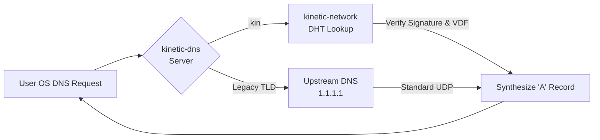

# Chapter 8: Architecture Walkthrough (`kinetic-network` & `kinetic-dns`)

If `kinetic-core` defines the cryptographic rules and `kinetic-daemon` orchestrates the system, then `kinetic-network` and `kinetic-dns` are the physical gateways. They represent the boundary layers where the untrusted outside world collides with the mathematically enforced reality of the local client.

In this chapter, we explore the modular architecture that powers the P2P Kademlia gossip filtering and local OS DNS interception.

---

## 1. The Immunological Filter: `kinetic-network`

The `kinetic-network` crate utilizes `libp2p-kad` to participate in the global DHT swarm. However, to enforce Competitive Gossip, Kinetic implements a highly hostile, modular architecture that acts as a strict cryptographic filter.

### 1.1 The Modular Subsystems

Rather than a monolithic event loop, the network crate is cleanly decoupled into distinct operational modules:

```mermaid
graph TD
    Client[Client Abstraction<br/>(client/)] -->|Commands| EventLoop
    
    subgraph Kademlia Event Loop (event_loop/)
        EventLoop[Core Loop<br/>(core.rs)] --> Handlers[Event Handlers<br/>(handlers.rs)]
        EventLoop --> Swarm[Swarm Builder<br/>(swarm_builder.rs)]
    end
    
    Handlers -->|Gossip/Put| Store
    
    subgraph Record Store (store/)
        Store[Core Store<br/>(core.rs)] --> Verify[Cryptographic Verification<br/>(verification.rs)]
        Store --> StoreHandlers[Store Handlers<br/>(handlers.rs)]
    end
    
    Verify -->|Reject/Accept| Store
```

### 1.2 `event_loop/` - The Concurrency Engine
The `event_loop` module manages all incoming and outgoing `libp2p` network events. 
- **`core.rs`**: Houses the main asynchronous loop.
- **`handlers.rs`**: Specifically processes distinct Kademlia events (inbound requests, routing updates, peer discoveries) without polluting the main loop.
- **`swarm_builder.rs`**: Constructs the underlying libp2p swarm, establishing transport protocols (TCP/QUIC) and noise encryption.

### 1.3 `store/` - The Cryptographic Immune System
The `KineticRecordStore` intercepts every single piece of data a remote peer attempts to store on the local node. 
- **`core.rs`**: Maintains the in-memory or persisted hashmap of active network records.
- **`verification.rs`**: The front line of defense. It strictly deserializes incoming payloads, validates the Ed25519 signature, reconstructs the Hash Commitment, and evaluates the VDF Proof-of-Time mathematically. If any of these checks fail, the record is outright rejected.
- **`handlers.rs`**: Manages the integration with the core Kademlia trait implementation.

This active immune response ensures that fake or incomplete data cannot propagate beyond the specific peer the attacker is directly interacting with.

---

## 2. The OS Interceptor: `kinetic-dns`

The `kinetic-dns` crate leverages the `hickory-dns` framework to intercept the user's OS-level traffic seamlessly.

### 2.1 Split-DNS Traffic Handling

The DNS server intercepts traffic directly on `127.0.0.1:53` and makes an immediate routing decision based on the Top-Level Domain (TLD).



1. **Sovereign Interception (`.kin`)**: If the query ends in `.kin`, the handler issues a Kademlia `GET` query to the `kinetic-network` module. The network fiercely validates the record against eclipse attacks and returns a mathematically verified payload. The DNS server then synthesizes a perfectly standard DNS `A` record containing the decentralized IP, tricking the browser into natively resolving the Web3 application.
2. **Legacy Pass-Through**: For all non-`.kin` queries (like `google.com`), the DNS handler acts as a transparent tunnel, instantly forwarding the raw byte buffer to an upstream resolver (like Cloudflare or Google). 

Through this robust modular design, the protocol effectively weaponizes the user's local operating system, creating a parallel, mathematically sovereign internet that seamlessly coexists alongside the legacy centralized infrastructure.
