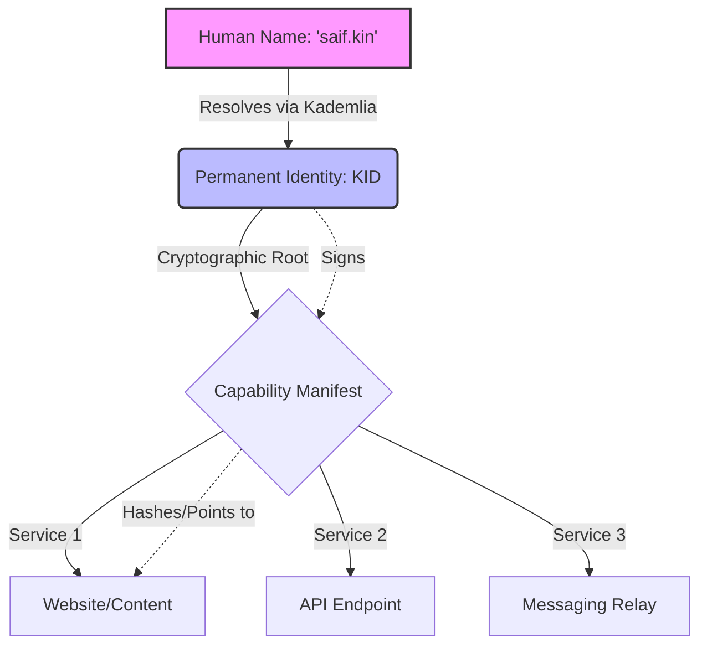

# Kinetic Identity Architecture (KID)
## Beyond DNS: Human Names, Permanent Identities, and Verifiable Services

**Version 1.0 (Formal Specification)**

## Abstract
Most decentralized naming systems attempt to replicate the Domain Name System (DNS) without addressing its fundamental limitations. Traditional DNS answers a single question:

> What network location corresponds to this name?

A DNS record ultimately resolves human-readable identifiers into network locations (IP addresses). However, modern digital entities are no longer merely servers. A single online identity may expose websites, APIs, storage systems, AI agents, messaging endpoints, peer-to-peer applications, and future services that do not map naturally to a single machine or location.

This document formally proposes a new architecture for Kinetic. Rather than acting as a decentralized DNS replacement, Kinetic has evolved into a mature **Identity-Centric Service Discovery Network**.

The core thesis is a strict, four-layer progression:
**Human Name ↓ Permanent Identity (KID) ↓ Capability Manifest ↓ Verifiable Services**

Instead of resolving names into locations, Kinetic resolves names into cryptographic identities capable of exposing arbitrary services. This creates a generalized naming primitive that separates Human Discovery, Identity, Service Discovery, and Content Distribution into independent, mathematically verifiable layers with distinct mutability guarantees.

---

## 1. The Core Philosophy: Name $\neq$ Identity

A surprising number of naming systems never properly separate a human-readable alias from the underlying identity.

Suppose `saif.kin` belongs to Alice. Later, ownership transfers to Bob. 
The name remains `saif.kin`, but the underlying identity has changed completely. 

If a system conflates the Name and the Identity, it falls victim to **Semantic Attacks** (or Long Range Resurrection). A user might send funds or encrypted messages to `saif.kin` assuming Alice still owns it, only to have Bob intercept them.

Therefore, the foundational axiom of the Kinetic Identity Architecture is:

> **Name $\neq$ Identity**

Kinetic explicitly separates these concepts. A name is an ephemeral, transferable routing alias. An identity is a permanent, immutable cryptographic anchor.

---

## 2. The Four-Layer Architecture

Kinetic combines four concepts that are traditionally separated. Each layer has a distinct purpose and is governed by different mutability rules.

### Layer 1: Human Namespace
Example: `saif.kin`

**Purpose:**
* Human discovery
* Branding and Reputation
* Memorability

The namespace is secured using Kinetic's VDF-based registration system. Names are transferable, and ownership may change over time based on the Heartbeat and Escalation algorithms. Therefore, names are **not** permanent identities.

### Layer 2: Permanent Identity (KID)
A name does not resolve to an IP address. Instead, it resolves to a Kinetic Identity Document (KID):

`saif.kin` $\rightarrow$ `did:kin:kid1abc9f7...`

The KID becomes the permanent cryptographic root of trust. It is bound to an Ed25519 or secp256k1 keypair.

**KID Schema Example:**
```json
{
  "kid": "did:kin:kid1abc9f7...",
  "pubkey": "ed25519:8b3a...",
  "created_at": 1750000000,
  "revocation_key": "ed25519:4f2c..."
}
```

Unlike names:
* KIDs are permanent and non-transferable.
* KIDs are strictly cryptographic and machine-oriented.

A KID represents an entity. A name represents a human-facing alias pointing to that entity. If `saif.kin` changes ownership, it simply points to a different KID.

### Layer 3: Capability Manifest
A KID points to a Capability Manifest. The manifest describes exactly what services this identity currently exposes to the network.

**Capability Manifest Schema Example:**
```json
{
  "version": "1.0",
  "owner": "did:kin:kid1abc9f7...",
  "services": [
    {
      "type": "website",
      "protocol": "https",
      "target": "104.21.44.11"
    },
    {
      "type": "api",
      "protocol": "grpc",
      "target": "api.backend.local",
      "port": 50051
    },
    {
      "type": "nostr-relay",
      "protocol": "wss",
      "target": "relay.nostr.info"
    }
  ],
  "signature": "0x7a8b9c..."
}
```

**Why Manifests Matter:**
Without manifests (`Identity ↓ Content`), the architecture is limited to static websites. With manifests (`Identity ↓ Services ↓ Content`), the protocol becomes service-agnostic. New applications and services can be introduced in the future without ever changing the core naming layer.

### Layer 4: Content and Compute
Services ultimately resolve to actionable content or compute.
Examples: Website Files, APIs, AI Chatbots, Databases, Messaging Relays.

**Content is Not Kinetic's Responsibility.**
Kinetic answers: *"Who owns this name?"* and *"What services exist for this identity?"*
It does not answer: *"Where are the bytes stored?"*

Just as DNS does not guarantee a website remains online, Kinetic does not guarantee content availability or execute dynamic backend code. Content hosting and compute remain the responsibility of infrastructure operators (whether via centralized clouds or decentralized storage like IPFS/BitTorrent).

---

## 3. Light Client Resolution Architecture

Because ownership state in Kinetic is entirely encapsulated inside self-authenticating, mathematically verifiable payloads (Signed Lease Records), a client does not need to participate in Kademlia peer discovery to resolve a name. 

**Kinetic supports trust-minimized light clients through untrusted gateway acquisition and local cryptographic verification of lease records.**

This is mathematically equivalent to Bitcoin’s SPV (Simplified Payment Verification) architecture, unlocking Kinetic for iOS, Android, and Web Browsers without requiring them to run embedded DHT nodes.

### The Untrusted Gateway Model
The resolution flow for a light client (e.g., a standard web browser) is straightforward:

1. **Browser** requests lease records via standard HTTPS from an untrusted gateway.
2. **Gateway** acts purely as a data transport, querying the DHT and returning the raw payloads.
3. **Browser** locally verifies the cryptographic signatures, the `drand` heartbeat timestamps, and the VDF proofs.

The critical insight is that the gateway is **not** a Trusted Resolver; it is merely a Data Transport. It cannot forge ownership, forge VDFs, or forge heartbeats because local verification stops that immediately. The cryptography decides the truth, not the peer.

### Mitigating Gateway Censorship
While a malicious gateway cannot forge a record, it *can* censor the network by intentionally hiding the newest lease record, causing the browser to resolve an outdated owner.

To mitigate this, light clients query a Minimum Gateway Set (e.g., 3 independent public gateways). The client collects all returned lease records, performs local verification on all of them, and deterministically chooses the winning payload using the Protocol Specification v1 rules (the oldest initial commitment tied-broken by the XOR distance to a future `drand` pulse).

Once a single honest gateway is queried, malicious censorship by the others becomes mathematically irrelevant.

---

## 4. The Complete Kinetic Stack Flow



## Conclusion

Kinetic began as a decentralized naming protocol. However, through rigorous architectural evolution, it has matured into something much more comprehensive.

Instead of a simple:
**Name ↓ Location**

Kinetic provides a mathematically verifiable stack:
**Human Name ↓ Identity ↓ Services ↓ Content**

This transforms naming from machine resolution into identity-driven service discovery. Under this model, Kinetic becomes more than a decentralized domain system. It becomes the foundational identity-centric service layer for the internet.
