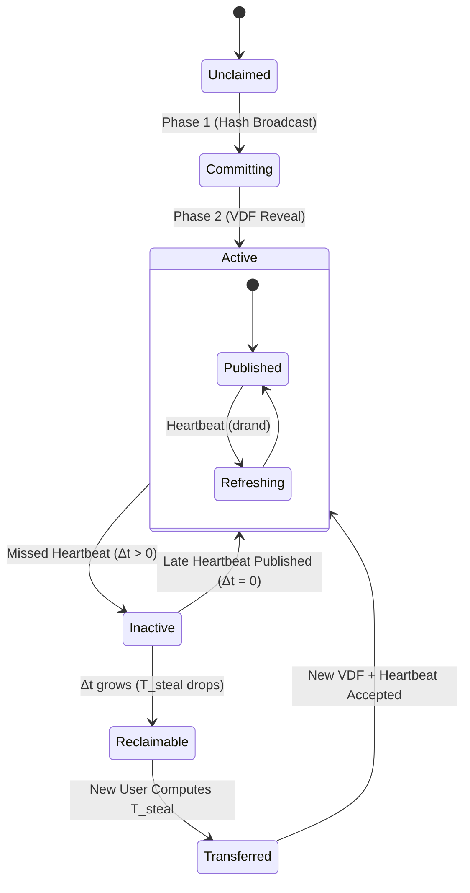

# Kinetic Protocol Specification v2
## A Decentralized, Identity-Centric Service Discovery Network

**Version 2.0 (Formal Specification)**

## Abstract
Kinetic is a completely decentralized protocol that maps human-readable names to cryptographic identities (KIDs), which in turn map to service manifests. Kinetic eliminates the need for blockchains, consensus algorithms, or trusted resolution authorities by strictly utilizing verifiable delay functions (VDFs), cryptographic signatures, and a Kademlia Distributed Hash Table (DHT).

This document serves as the formal architectural specification for the Kinetic protocol, encompassing the resolution lifecycle, data schemas, empirical proofs, and light-client operational models.

---

## 1. The Formal State Machine (Protocol V2)

Ownership of a Kinetic name is an ephemeral state defined purely by cryptographic mathematics, not by database registry entries. The state of any name traverses the following lifecycle:



### State Definitions
- **Unclaimed:** The name has never been registered. $T_{\text{steal}} = T_{\text{base}}$.
- **Committing:** A user has anchored a blind Hash Commitment to a `drand` pulse on the DHT.
- **Active:** A valid VDF `Reveal` was published, completing the Two-Phase Commit/Reveal.
- **Inactive:** The owner has failed to publish a recent heartbeat. $\Delta t > 0$.
- **Reclaimable:** The owner has been inactive long enough that $T_{\text{steal}}$ has decayed to a computationally feasible threshold for a challenger.
- **Transferred:** A challenger successfully computed the decayed $T_{\text{steal}}$ VDF and claimed the name.

---

## 2. Empirical Protocol Economics

Kinetic's security relies on the asymmetry of VDF verification and the Grace-Period Escalation curve. To formally prove the economic deterrents, empirical simulations were conducted.

### 2.1 The Escalation Curve ($T_{\text{steal}}$)
When a name becomes `Inactive`, the difficulty to claim it decays according to the equation:
$$ T_{\text{steal}} = T_{\text{base}} \times e^{\left(\frac{k}{\Delta t}\right)} $$
*Assume $T_{\text{base}} = 10,000,000$ iterations and an adversary utilizing an ASIC computing $10^9$ iterations/second.*

| Idle Time ($\Delta t$) | $T_{\text{steal}}$ (Iterations) | Estimated ASIC Time |
|-------------------------|--------------------------------|----------------------|
| 1 Hour                  | $\infty$                       | Forever              |
| 12 Hours                | $1.14 \times 10^{33}$          | > Age of Universe    |
| 1 Day                   | $1.07 \times 10^{20}$          | > 100 Years          |
| 1 Week                  | $7.27 \times 10^{8}$           | 0.73 Seconds         |
| 1 Month                 | $2.72 \times 10^{7}$           | 0.03 Seconds         |

**Conclusion:** Active names are mathematically impossible to steal. Abandoned names are cleanly garbage-collected.

### 2.2 DHT Keyspace Dispersion (Eclipse Defense)
Kinetic stores $M=32$ redundant payloads across the Kademlia DHT using $K_i = \text{SHA256}(\text{name} \parallel i)$.
A simulation generating $1,000,000,000$ names ($32,000,000,000$ derived keys) mapped into 65,536 distinct 16-bit Kademlia sectors yielded:
- **Expected Keys per Sector:** 488,281
- **Variance:** $3.24\%$

**Conclusion:** The SHA-256 derivation provides perfect uniform dispersion. Because the keys are statistically uncorrelated, successfully censoring a name requires uniform control over the entire 256-bit DHT keyspace, making Eclipse attacks practically impossible.

---

## 3. Payload Schemas

To prevent DDoS and OOM (Out-of-Memory) attacks, **all serialized JSON payloads must not exceed 64 KB (65,536 bytes)**. Payloads exceeding this limit are instantly dropped by DHT nodes.

### 3.1 The Reveal Struct (Protocol Version 2)
The core cryptographic truth that proves a user owns a name, finalizing the Two-Phase Commit.

```json
{
  "protocol_version": 2,
  "name": "saif.kin",
  "payload": [ 123, 34, ... ], // Contains serialized DnsZone
  "salt": [ 0, 1, 2, ... ], // 32 bytes
  "drand_pulse": 29970036,
  "drand_randomness": "e66884daaefd...",
  "iterations": 4194304,
  "vdf_proof": {
    "proof_bytes": [ 5, 89, ... ]
  },
  "pubkey": [ 1, 2, 3, ... ], // 32 bytes Ed25519
  "signature": [ 4, 5, 6, ... ] // 64 bytes
}
```

### 3.2 The Kinetic Identity Document (KID)
The permanent semantic anchor of the user. To prevent spam, KIDs must be serialized using **Canonical JSON Serialization (JCS)** and require a **20-bit Hashcash Proof-of-Work (PoW)**.

```json
{
  "kid": "did:kin:ed25519-abc123def456...",
  "rotation_keys": ["ed25519-xyz987..."],
  "manifest_hash": "sha256-456def...",
  "pow_nonce": 8493021,
  "signature": "sig-kid-abc..."
}
```

### 3.3 The Capability Manifest
The mapping of the Identity to concrete services. Also requires a 20-bit Hashcash PoW.

```json
{
  "services": {
    "website": {
      "type": "ipv4",
      "endpoint": "198.51.100.14"
    },
    "api": {
      "type": "grpc",
      "endpoint": "api.saifmukhtar.dev:443"
    },
    "nostr": {
      "type": "websocket",
      "endpoint": "wss://relay.kinetic.network"
    }
  },
  "pow_nonce": 9238471,
  "signature": "sig-kid-abc..."
}
```

---

## 4. The Resolution Algorithm

Kinetic supports "trust-minimized light clients". A browser does not need to run a DHT node; it simply requests data from untrusted HTTP gateways and verifies the payloads locally.

**The Client-Side Resolution Flow:**
1. **Fetch:** Client requests payloads for $K_1 \dots K_{32}$ from 3 independent public Gateways.
2. **Collect:** Client aggregates the JSON payloads.
3. **Verify Signatures:** Discard any payload where the Ed25519 signature fails.
4. **Verify VDF:** Discard any payload where the Chia Class Group VDF validation fails.
5. **Deterministic Selection:** 
   - Select the payload with the oldest valid `drand_pulse` (Initial Commitment).
   - If tied, **resolve via XOR Tie-Breaker**: Sort payloads by the XOR distance of their VDF output to the subsequent `drand` pulse. Evaluate heavy VDF verification lazily over this sorted list to prevent async executor starvation.
6. **Extract Identity:** Output the `pubkey` of the winning payload.
