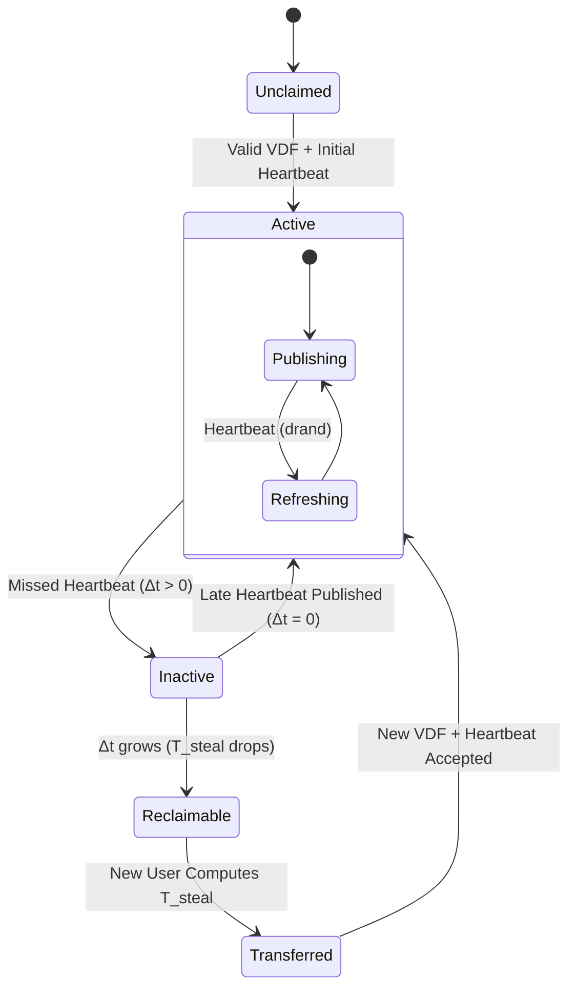

# Kinetic Protocol Specification v1
## A Decentralized, Identity-Centric Service Discovery Network

**Version 1.0 (Formal Specification)**

## Abstract
Kinetic is a completely decentralized protocol that maps human-readable names to cryptographic identities (KIDs), which in turn map to service manifests. Kinetic eliminates the need for blockchains, consensus algorithms, or trusted resolution authorities by strictly utilizing verifiable delay functions (VDFs), cryptographic signatures, and a Kademlia Distributed Hash Table (DHT).

This document serves as the formal architectural specification for the Kinetic protocol, encompassing the resolution lifecycle, data schemas, empirical proofs, and light-client operational models.

---

## 1. The Formal State Machine

Ownership of a Kinetic name is an ephemeral state defined purely by cryptographic mathematics, not by database registry entries. The state of any name traverses the following lifecycle:



### State Definitions
- **Unclaimed:** The name has never been registered. $T_{\text{steal}} = T_{\text{base}}$.
- **Active:** A valid VDF commitment exists, and the current owner has published a heartbeat within the current 30-second `drand` round ($\Delta t = 0$).
- **Inactive:** The owner has failed to publish a recent heartbeat. $\Delta t > 0$.
- **Reclaimable:** The owner has been inactive long enough that $T_{\text{steal}}$ has decayed to a computationally feasible threshold for a challenger.
- **Transferred:** A challenger successfully computed the decayed $T_{\text{steal}}$ VDF and claimed the name. The old owner's payload is mathematically nullified.

---

## 2. Empirical Protocol Economics

Kinetic's security relies on the asymmetry of VDF verification and the Grace-Period Escalation curve. To formally prove the economic deterrents, empirical simulations were conducted.

### 2.1 The Escalation Curve ($T_{\text{steal}}$)
When a name becomes `Inactive`, the difficulty to claim it decays according to the equation:
$$ T_{\text{steal}} = T_{\text{base}} \times e^{\left(\frac{k}{\Delta t}\right)} $$
*Assume $T_{\text{base}} = 10,000,000$ iterations and an adversary utilizing an ASIC computing $10^9$ iterations/second.*

| Idle Time ($\Delta t$) | $T_{\text{steal}}$ (Iterations) | Estimated ASIC Time |
|-------------------------|--------------------------------|----------------------|
| 1 Hour                  | $\infty$                       | Forever              |
| 12 Hours                | $1.14 \times 10^{33}$          | > Age of Universe    |
| 1 Day                   | $1.07 \times 10^{20}$          | > 100 Years          |
| 1 Week                  | $7.27 \times 10^{8}$           | 0.73 Seconds         |
| 1 Month                 | $2.72 \times 10^{7}$           | 0.03 Seconds         |

**Conclusion:** Active names are mathematically impossible to steal. Abandoned names are cleanly garbage-collected.

### 2.2 DHT Keyspace Dispersion (Eclipse Defense)
Kinetic stores $M=5$ redundant payloads across the Kademlia DHT using $K_i = \text{SHA256}(\text{name} \parallel i)$.
A simulation generating $1,000,000,000$ names ($5,000,000,000$ derived keys) mapped into 65,536 distinct 16-bit Kademlia sectors yielded:
- **Expected Keys per Sector:** 76,293
- **Min Keys in Sector:** 75,094
- **Max Keys in Sector:** 77,563
- **Variance:** $3.24\%$

**Conclusion:** The SHA-256 derivation provides perfect uniform dispersion. Because the keys are statistically uncorrelated, successfully censoring a name requires uniform control over the entire 256-bit DHT keyspace, making Eclipse attacks practically impossible.

---

## 3. The Resolution Algorithm

Kinetic supports "trust-minimized light clients". A browser does not need to run a DHT node; it simply requests data from untrusted HTTP gateways and verifies the payloads locally.

**The Client-Side Resolution Flow:**
1. **Fetch:** Client requests `LeaseRecords` for $K_1 \dots K_5$ from 3 independent public Gateways.
2. **Collect:** Client aggregates the JSON payloads.
3. **Verify Signatures:** Discard any payload where the Ed25519 signature fails.
4. **Verify VDF:** Discard any payload where the Wesolowski proof $O(\log T)$ validation fails.
5. **Deterministic Selection:** 
   - Select the payload with the oldest valid `drand_round_t1` (Initial Commitment).
   - If tied, select the payload whose VDF output $y$ is closest (XOR distance) to the subsequent `drand` pulse $B_{t_2}$.
6. **Extract Identity:** Output the `kid_pubkey` of the winning payload.

---

## 4. Payload Schemas

### 4.1 Signed Lease Record (The Ownership Payload)
The core cryptographic truth that proves a user owns a name.

```json
{
  "name": "saif.kin",
  "kid_pubkey": "ed25519-abc123def456...",
  "vdf_proof": {
    "drand_round_t1": 1234567,
    "difficulty_t": 10000000,
    "input_x": "0xabc...",
    "output_y": "0xdef...",
    "wesolowski_pi": "0x123..."
  },
  "heartbeat": {
    "drand_round_current": 1234600,
    "signature": "sig-789..."
  }
}
```

### 4.2 The Kinetic Identity Document (KID)
The permanent semantic anchor of the user.

```json
{
  "kid": "did:kin:ed25519-abc123def456...",
  "rotation_keys": ["ed25519-xyz987..."],
  "manifest_hash": "sha256-456def..."
}
```

### 4.3 The Capability Manifest
The mapping of the Identity to concrete services.

```json
{
  "services": {
    "website": {
      "type": "ipv4",
      "endpoint": "198.51.100.14"
    },
    "api": {
      "type": "grpc",
      "endpoint": "api.saifmukhtar.dev:443"
    },
    "nostr": {
      "type": "websocket",
      "endpoint": "wss://relay.kinetic.network"
    }
  },
  "signature": "sig-kid-abc..."
}
```

---

## 5. Gateway Economics

Because Kinetic Gateways do not execute consensus algorithms or hold private keys, they function purely as **Data Transports** (CDNs for signed records). 

This enables Incentiveless Infrastructure (similar to Tor exit nodes, IPFS gateways, and Nostr relays). 
- **Compute Cost:** Negligible. Gateways merely relay JSON files from the DHT.
- **Bandwidth Cost:** Negligible. A Lease Record is $\approx 1$ KB.
- **Trust Requirement:** Zero. The local client verifies the math.

This model seamlessly bridges Web3 cryptography with Web2 consumer access, allowing Android, iOS, and standard web browsers to natively resolve `.kin` names using hardcoded lists of community-operated HTTP gateways.

---

## 6. Protocol Maturity Checklist

This checklist tracks the maturation of Kinetic from a theoretical construct to a production-grade decentralized infrastructure.

| Component | Status | Description |
|-----------|--------|-------------|
| **Naming Model** | ✅ Specified | Separation of Human Names from Immutable Identities. |
| **Ownership Proofs** | ✅ Specified | VDF-based commitments + Heartbeat renewals. |
| **Identity (KID)** | ✅ Specified | Permanent semantic anchor decoupled from names. |
| **Service Manifest** | ✅ Specified | Mapping of KIDs to IPv4/IPv6, APIs, WebSockets, etc. |
| **Resolution Algo** | ✅ Specified | The 6-step Light Client validation flow + XOR tie-breaker. |
| **Gateway Model** | ✅ Specified | Incentiveless "dumb-pipe" HTTP relays (CDN paradigm). |
| **State Machine** | ✅ Specified | Formal definitions for Active, Inactive, and Reclaimable. |
| **Adversarial Analysis** | ✅ Specified | Documented mitigations against Eclipse, DoS, and Replay attacks. |
| **Simulation Suite** | ✅ Implemented | Rust-based empirical verification of Escalation Curve and DHT bounds. |
| **Reference Implementation** | 🔄 Future Work | Production-ready daemon in Rust (`kinetic-core`, `kinetic-network`). |
| **Formal Proofs** | ⏳ Future Work | TLA+ specification or Coq proofs for the state machine transitions. |
| **Security Audit** | ⏳ Future Work | Independent review of the VDF parameters and resolution rules. |
| **Public Testnet** | ⏳ Future Work | Large-scale adversarial deployment. |
