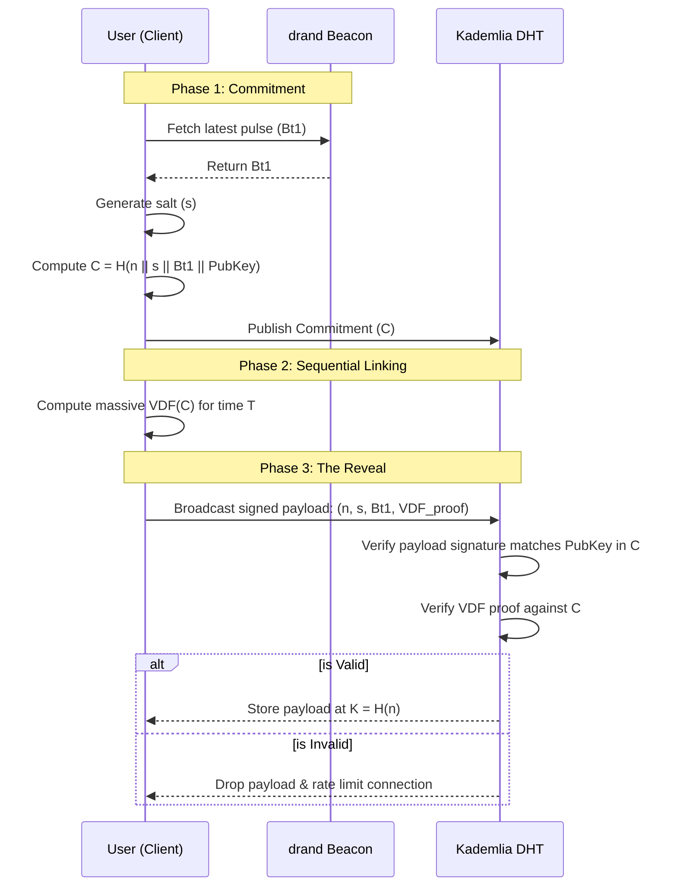
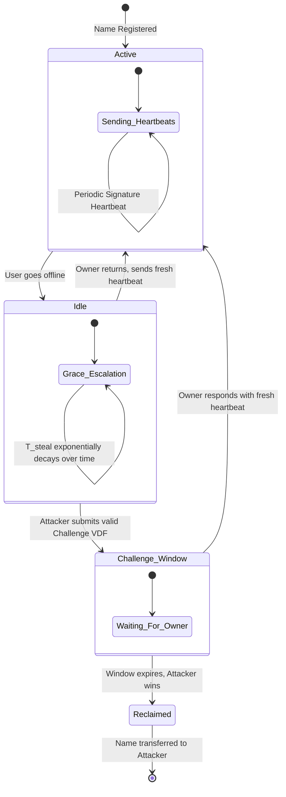
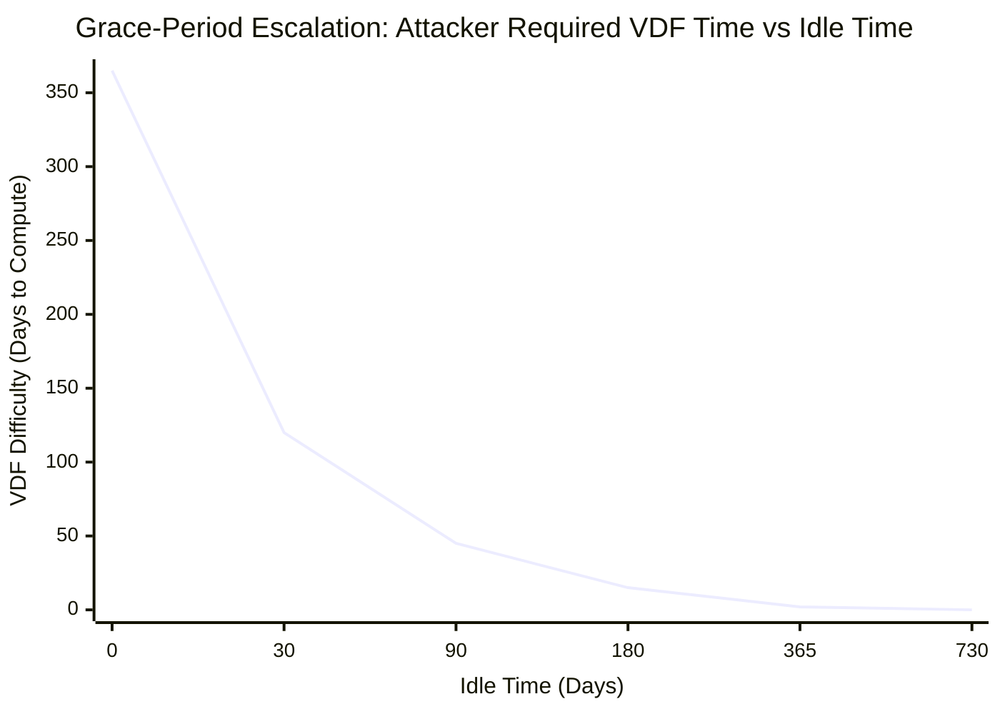
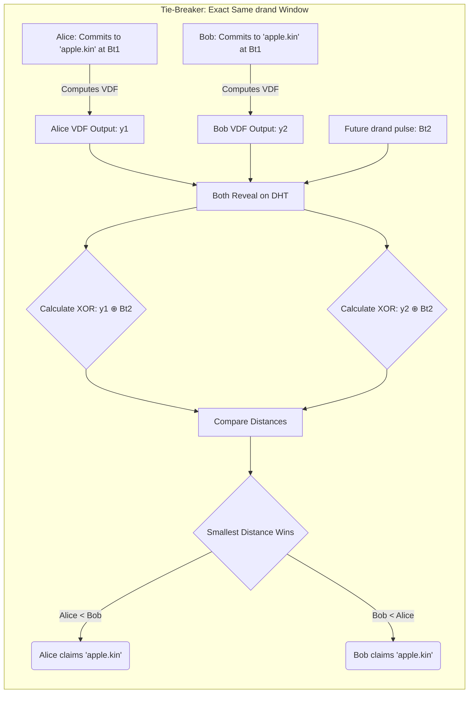
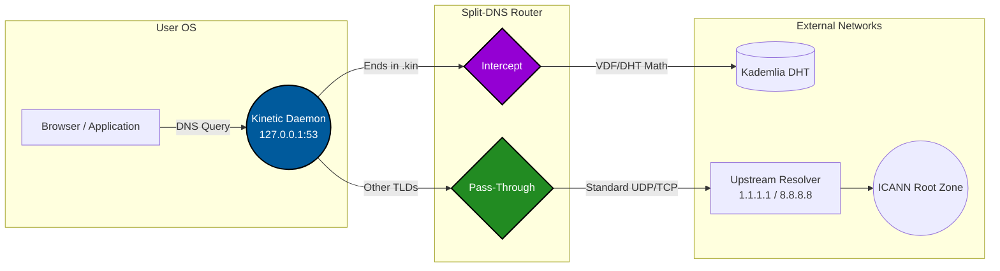

# The Kinetic Protocol: A Stateless, Sybil-Resistant Naming System via Proof-of-Patience and Computational Leases

### Abstract

Current decentralized identity and naming architectures inevitably replicate the rent-seeking vulnerabilities of Web2 registry systems, creating an artificial economy of digital landlordism. To secure human-readable namespaces against Sybil attacks, existing protocols rely either on continuous capital allocation (perpetual renewal fees) or intrusive, non-scalable identity verification layers (Proof of Personhood). Both approaches compromise the core tenets of user sovereignty by favoring concentrated wealth or introducing severe onboarding friction.

This paper introduces the **Kinetic Protocol**, a decentralized naming primitive that completely decouples human-meaningful handle allocation from both financial capital and physical identity. Kinetic replaces monetary cost with sequential computational friction, establishing a self-cleaning namespace secured purely by math and time.

The protocol operates on a three-tier cryptographic security lifecycle:

1. **Commit-Reveal & Sequential Linking:** To eliminate network front-running and blind sniper attacks, registration requests are initially broadcast as obscured cryptographic commitments anchored to an external randomness beacon (`drand`) and bound uniquely to the claimant's public key. The subsequent Verifiable Delay Function mathematically proves the commitment existed in the past, completely eliminating the need for a synchronized network clock.
2. **Dynamic Difficulty via Verifiable Delay Functions (VDFs):** To eliminate mass-dictionary squatting, the computational expenditure required to claim a name scales inversely with its character length. An attacker with massive hardware concurrency cannot resolve a single contested handle faster than a standard client, shifting the cost of entry from hardware scale to sheer patience. The network difficulty is globally synchronized via the `drand` beacon, with a fallback re-squaring mechanism to ensure difficulty scales with hardware advancements.
3. **The Multi-Tiered Lease:** To maintain namespace fluidity without an administrative state, name retention requires an active, low-overhead cryptographic signature heartbeat. If a heartbeat flatlines, the name is not instantly lost; instead, it enters a Grace-Period Escalation where the computational cost to steal the name increases the less idle it has been. Users can also opt into Hibernation VDFs for long-term offline periods or utilize Watchtowers for convenience.

By combining these mechanics within a conceptually stateless, distributed peer-to-peer network layer defended by Competitive Gossip and Hashcash PoW, Kinetic achieves global, human-meaningful, and unique handle resolution.

> **Note on Protocol Logic:** The fundamental breakthrough of Kinetic is that it doesn't seek to cryptographically verify if a user is a single physical human. Instead, it enforces an economic reality where mass-scale automated squatting becomes computationally and energetically ruinous, while remaining completely friction-free and zero-cost for a legitimate, solitary developer.

---

## 2. The Failure of Digital Landlordism: Capital-Gated Registries and the Identity Bottleneck

To understand the necessity of the Kinetic Protocol, we must first formalize the failure modes of existing decentralized naming architectures. The core problem of any global namespace is bounded by Zooko’s Triangle, which posits that network identifiers cannot simultaneously be human-meaningful, decentralized, and secure.

Attempts to square the triangle inevitably confront the Sybil attack vector: if names are human-meaningful and free to register without a central gatekeeper, a solitary attacker can instantaneously generate millions of pseudonymous network nodes to hoard the entire namespace. To mitigate this without centralized authorities, decentralized systems typically rely on one of two gating functions: **Capital** (monetary fees) or **Identity** (Proof of Personhood). Both introduce fatal flaws to developer sovereignty and system accessibility.

### 2.1 The Sybil Threat and the Necessity of Friction

In a permissionless environment, the cost of generating a network request is effectively zero. Therefore, if the namespace lacks a friction mechanism, the network is highly vulnerable to dictionary and enumeration attacks.

Let $C_a$ be the cost to the attacker, and $N$ be the total addressable space of desirable names. If the registration cost function $C_a(N) \approx 0$, a rational attacker will attempt to claim $N$. To secure the registry, a protocol must ensure that the marginal cost of acquiring the $i$-th name, $c_i$, scales such that attempting to acquire a vast number of names becomes prohibitively expensive:

$$ \sum_{i=1}^{N} c_i > R_{max} $$

where $R_{max}$ is the maximum resources available to the attacker. The debate in decentralized engineering is entirely about what unit of friction the variable $c$ represents.

### 2.2 The Flaw of Capital-Gated Names (Economic Rent-Seeking)

The most common approach—utilized by legacy blockchain-based naming systems—is to define $c$ as financial capital. To prevent permanent squatting and dead state, these systems institute recurring renewal fees based on string length.

While financially gating the namespace solves the Sybil problem, it introduces severe economic downstream effects:

* **Digital Landlordism:** A capital-gated registry inherently favors entities with the deepest financial liquidity. Wealthy speculators can afford the carry costs to hoard premium, short-character names, waiting to extract rent from legitimate developers or organizations who actually intend to build on them.
* **Developer Pricing-Out:** For a protocol meant to serve as a foundational network primitive (e.g., exposing a local port or routing a decentralized app), an annual monetary fee creates a continuous liability. It violates the core ethos of open-source infrastructure: peer-to-peer network routing should not require a subscription fee.
* **The Valuation Paradox:** In a capital-gated system, a name's security is paradoxically tied to its market volatility. If the underlying cryptocurrency's fiat value spikes, the cost to register or renew a domain becomes inaccessible to normal users, actively stalling network adoption.

### 2.3 The Identity Bottleneck (Proof of Personhood)

To eliminate capital requirements, alternative protocols attempt to define $c$ as physical human uniqueness. These Proof of Personhood (PoP) systems ensure that one human maps to exactly one identity, effectively hard-capping $N \leq 1$ per person.

While mathematically elegant for Sybil resistance, PoP introduces severe sociotechnical bottlenecks:

* **Extreme Onboarding Friction:** Synchronous video verification parties, specialized hardware (iris scanning), or global cryptographic puzzle ceremonies destroy the developer experience. A user cannot instantly spin up a tunnel at 2:00 AM if they must wait for a scheduled validation epoch.
* **Trust Anchors and Privacy:** Extracting unique identity, even via zero-knowledge proofs (zkTLS or NFC passports), often shackles the decentralized system to high-friction Web2 institutions or government-issued credentials.
* **The Multiple-Alias Reality:** Developers legitimately need multiple handles for different environments (e.g., staging servers, personal blogs, anonymous routing). Forcing a strict 1:1 mapping between a human and a network handle is an artificial constraint that misunderstands how internet infrastructure is naturally deployed.

### 2.4 The Impasse

We are left with an architectural impasse: a truly decentralized namespace cannot survive without friction, but defining that friction as **money** recreates Web2 rent-extraction, and defining it as **identity** destroys the user experience.

The Kinetic Protocol abandons both. By defining $c$ strictly as un-parallelizable time and kinetic computation, we return to the purest form of permissionless security.

---

## 3. The Kinetic Architecture: Cryptographic Mechanics

To achieve a globally sovereign namespace without a central supervisor, the Kinetic Protocol relies on a strictly sequential, three-phase cryptographic lifecycle. The architecture is designed to mathematically isolate and neutralize specific malicious behaviors—namely front-running, dictionary squatting, and dead-state hoarding.

### 3.1 Phase I: Clockless Front-Running Neutralization via Sequential VDF Linking

In any public, permissionless registry, transmitting a plaintext claim for a desirable string exposes the user to front-running. A sniper bot monitoring the network can observe the request, duplicate it, and propagate it with a higher network priority.

To render sniper bots completely blind without relying on a synchronized global clock, Kinetic mandates a **Sequential VDF Linking** scheme anchored to an external randomness beacon (specifically, `drand`, which provides highly reliable, lightweight BLS threshold signatures every 30 seconds).

Let $S$ be the set of all valid human-readable strings, and let $n \in S$ be the target name. 

1. **Commitment Generation:** The user generates a high-entropy salt $s \in \{0,1\}^{256}$ and fetches the latest `drand` randomness pulse $B_{t_1}$. Crucially, the client binds their public key into the hash commitment: $C = H(n \parallel s \parallel B_{t_1} \parallel \text{PubKey})$.
2. **Sequential VDF Linking:** The client does not merely wait; they must use $C$ as the base seed input for the massive Verifiable Delay Function (VDF) computation. The VDF takes $T$ time to compute.
3. **The Reveal:** After $T$ time, the VDF completes. The client broadcasts a signed payload containing the plaintext tuple $(n, s, B_{t_1}, \text{VDF}_{\text{proof}})$. Nodes verify that the payload signature matches the $\text{PubKey}$ embedded inside $C$. 



Because the `drand` pulse $B_{t_1}$ was unpredictable before $t_1$, an attacker cannot pre-compute the VDF. Because the VDF inherently takes $T$ time to solve, the completion of the VDF mathematically proves that the commitment $C$ existed at least $T$ time ago. If a sniper bot sees the reveal and attempts to steal the name, they must start their own VDF. By the time they finish at $t_1 + 2T$, the original claim is deeply embedded in the network. Furthermore, because the commitment $C$ is uniquely bound to the original user's public key, an attacker cannot simply intercept the reveal tuple and replay it wrapped in their own signature.

### 3.2 Phase II: Dynamic Verifiable Delay Functions (Dictionary Neutralization)

If the Commit-Reveal phase hides the target, the Verifiable Delay Function (VDF) serves as the protocol's primary Sybil-resistance mechanism.

A VDF is a cryptographic function $f: X \to Y$ that takes a prescribed amount of sequential time to evaluate, but is exponentially faster to verify. Crucially, a VDF cannot be accelerated through parallel processing. An attacker with an array of 10,000 ASICs cannot compute a single VDF any faster than a solitary user on a consumer-grade laptop.

#### The Mathematical Construction

To maintain a strict trustless philosophy, the Kinetic Protocol constructs its VDF over **Class Groups of Imaginary Quadratic Fields**, adopting the same mathematical foundations as the Chia network. Unlike RSA-based VDFs, Class Groups do not require a "Trusted Setup" ceremony to generate a modulus, eliminating human trust entirely.

The user is challenged to compute an output element $y$ within the Class Group given a base element $x$ and a time parameter $T$:

$$ y = x^{2^T} $$

Because the group order is unknown, the user is mathematically forced to execute $T$ sequential, non-parallelizable squarings. 

Alongside $y$, the prover generates a concise cryptographic proof $\pi$ using the **Wesolowski Proof Protocol**. While evaluating $y$ requires $O(T)$ operations and is computationally grueling, any node in the Kinetic network can verify the tuple $(x, y, \pi)$ in $O(\log T)$ time, ensuring network validation remains near-instantaneous.

#### Hardware Acceleration & Dynamic Difficulty

To ensure the Sybil defense doesn't decay over the decades as hardware single-thread performance improves, the protocol dynamically synchronizes the difficulty variable $k$.

* **Primary Driver (External Time Beacon):** The baseline difficulty constant $k$ is deterministically derived from the `drand` beacon height. This provides global consensus with zero coordination cost, slowly tightening the baseline difficulty over time.
* **Fallback (Re-Squaring):** If the beacon becomes unreachable, the protocol gracefully degrades to a static difficulty. To prevent long-term decay in a beacon-less world, any name crossing a multi-year epoch must refresh its claim with a "re-squaring" VDF.
* **Alert Layer (Local Observation):** Clients passively measure the rate of new registrations and computational lag. If hardware drastically outpaces the beacon's difficulty curve, clients raise a user-visible warning, providing a social signal for manual fallback adjustments without breaking deterministic consensus.

### 3.3 Phase III: The Hybrid Lease System (Dead-State Neutralization)

Capital-gated registries rely on financial renewal dates to expire abandoned names. Because Kinetic is free, a purely static registration would allow early adopters to permanently exhaust the namespace. Kinetic solves this via a hybrid computational lease system that protects users during legitimate offline periods while aggressively cleaning truly dead state.



#### Layer 1: Grace-Period Escalation (The Base Layer)

Ownership is maintained by a localized, continuous cryptographic signature heartbeat, requiring minimal background computation. 

If a user goes offline and misses their heartbeat, the name is **not** instantly evicted. Instead, it enters **Grace-Period Escalation**. An abandoned name requires an attacker to compute an *exponentially harder* VDF to steal it based on how long it has been idle. The difficulty to steal is formalized as:

$$ T_{\text{steal}}(\Delta t) = T_{\text{max}} \cdot e^{-\beta \cdot \Delta t} $$

where $\Delta t$ is the idle time, $T_{\text{max}}$ is the initial massive VDF difficulty (e.g., weeks of computation), and $\beta$ is the decay constant. 



To initiate a challenge without a centralized clock, the attacker must mathematically prove the idle time using the DHT state:
1. The attacker retrieves the last known valid heartbeat for the name. (Heartbeats include the current `drand` round: $\text{Heartbeat} = \text{Sign}_{\text{owner}}( \text{PubKey} \parallel \text{drand\_round} \parallel \text{nonce} )$).
2. The attacker calculates $\Delta t$ as the difference between the current `drand` round and the round in the owner's last signed heartbeat.
3. The attacker computes the Challenge VDF of difficulty $T_{\text{steal}}(\Delta t)$.
4. The attacker submits the challenge, referencing the old heartbeat.

Because the heartbeat is signed by the owner, the attacker cannot forge a newer heartbeat to artificially shorten the idle time. If the name is actually active, honest network nodes will hold a cached recent heartbeat that contradicts the attacker's $\Delta t$ claim, instantly invalidating the attack. 

Even if the attacker computes a valid Challenge VDF, this merely opens the **Challenge Window**. The original owner can return at any moment during this window and reclaim the name instantly with a single, standard heartbeat, effortlessly invalidating the attacker's massive computation.

#### Layer 2: Hibernation VDFs (Opt-In Planned Absence)

For users who know they will be offline for a long period (e.g., sabbatical), they can execute a massive, one-time sequential computation—the **Hibernation VDF**. By burning a 48-hour VDF, the user buys a "Hibernation Certificate" granting 1 year of complete heartbeat exemption. During this year, the grace-period escalation clock does not start, and the name mathematically cannot be challenged.

#### Layer 3: Watchtower Delegation (The Comfort Layer)

For ultimate uptime without continuous local CPU usage, a user can pre-generate a chain of signed heartbeat tokens and delegate them to a small set of decentralized "Watchtowers" (altruistic DHT nodes or a friend's daemon). The watchtowers broadcast the tokens on schedule. This is trust-minimized: a watchtower cannot steal a name; they can only withhold a heartbeat, at which point the robust Grace-Period Escalation base layer effortlessly catches the fall.

---

## 4. The Zero-Dollar Network Layer: Stateless Consensus via DHT

Kinetic achieves global consensus without a global ledger or blockchain by decoupling *data availability* from *state validation*.

### 4.1 The Kademlia DHT and Competitive Gossip

Kinetic leverages a **Kademlia Distributed Hash Table (DHT)** via the `libp2p` networking stack. When a user computes a VDF to claim a name, their daemon pushes the payload to the DHT address $K = H(n)$.

Because a standard DHT has no execution environment, it is inherently vulnerable to storage exhaustion attacks (spam). To prevent an attacker from flooding the DHT with invalid payloads, Kinetic introduces two critical defenses:

1. **Competitive Gossip:** Every DHT node performs the $O(1)$ VDF mathematical validation *before* storing or propagating a payload. If the math is invalid, the node drops the payload entirely. The network acts as an active immune system, ensuring that only cryptographically sound data consumes storage space.
2. **Lightweight Proof-of-Connection:** To prevent an attacker from opening millions of connections to spam mathematically invalid VDFs, every node requires a trivial, connection-specific Hashcash PoW. If a connection repeatedly sends mathematically invalid VDFs, the node aggressively rate-limits, drops the connection, and forces the attacker to pay the Hashcash again, making sustained CPU-exhaustion attacks economically irrational.

### 4.2 Deterministic Client-Side Validation

Consensus is not a state stored on a server; it is a deterministic calculation run by the user's own machine.

When a user resolves `saif.kin`:
1. **Fetch:** The local daemon queries the Kademlia DHT at $H(\text{saif})$ and retrieves the list of stored payloads.
2. **Filter (Math):** The daemon locally verifies the VDF proofs and Heartbeat nonces.
3. **Filter (Time):** Of the valid payloads, the daemon evaluates the sequential VDF timestamps anchored to the `drand` beacon.
4. **Resolve:** The daemon deterministically selects the payload with the earliest valid commitment and active heartbeat, extracts the routing IP address, and seamlessly resolves the local browser's request.

**Tie-Breaking (The XOR Lottery):** If two honest users generate valid commitments for the exact same name within the exact same 30-second `drand` window ($B_{t_1}$ is identical), the protocol must break the tie without recreating a grinding PoW race. The winner is determined by the payload whose VDF output $y$ has the smallest XOR distance to the subsequent `drand` pulse $B_{t_2}$ at the time the first reveal is published. Because neither user can predict the future `drand` pulse, and neither can manipulate their VDF output $y$ (which is deterministically derived from the fixed inputs), this functions as a perfectly fair, mathematically un-gameable lottery.

### 4.3 Cryptographic Payload Schemas

To ensure deterministic client-side validation across all nodes, the network relies on strict data schemas. Below is a representation of the Reveal Payload (the final structure stored in the Kademlia DHT).

```json
{
  "version": 1,
  "name": "saif.kin",
  "routing_target": "192.168.1.100", // Or a KID in the Identity Architecture
  "commitment": {
    "drand_round_t1": 3485721,
    "salt": "a1b2c3d4e5f6",
    "hash": "0x8f7a9..." 
  },
  "vdf_proof": {
    "iterations_T": 1000000,
    "output_y": "0x4b2c...",
    "wesolowski_pi": "0x9d3f..."
  },
  "heartbeat": {
    "drand_round_current": 3488000,
    "nonce": 42
  },
  "owner_pubkey": "ed25519:3a9b...",
  "signature": "0x7c4e..." // Signs the entire payload
}
```

Every node in the network independently verifies the `vdf_proof`, confirms the `drand_round` sequences, and checks the Ed25519 `signature` before serving this routing record.



### 4.3 The Economic Scalability Reversal

By utilizing a Kademlia DHT and client-side validation, the Kinetic Protocol operates on an inverted scalability curve. As the network scales from 1,000 to 1,000,000 users, the DHT becomes vastly more dense, routing hops become significantly shorter, and data retrieval speeds increase. Because validation is crowdsourced to the CPUs of the individual users resolving the names, the network's processing power scales perfectly in tandem with its user base.

The cost to operate the network remains exactly $0.

### 4.4 Mitigating DHT Eclipse Attacks via Redundant Deterministic Storage

#### The Vulnerability: Single-Key Eclipse Attacks

The protocol as described thus far assumes the Kademlia DHT acts as an honest bulletin board. In practice, permissionless DHTs are vulnerable to Eclipse attacks: an adversary can generate a large number of Sybil node IDs mathematically close to a target key $K$, becoming the authoritative storage peers for that key. Once in position, these malicious nodes can silently drop legitimate payloads and serve only the attacker's data.

If a resolver queries $K = H(n)$ and the attacker controls the surrounding keyspace, the resolver receives only the attacker's payload. Because client-side validation can only evaluate data it receives, and the attacker's payload contains a valid VDF proof and commitment, the resolver has no cryptographic basis to reject it. The honest registrant's payload simply never arrives. The XOR tie-breaker, which assumes both payloads are visible, is powerless against this network-layer censorship.

This is not a theoretical concern. Eclipse attacks have been demonstrated against Ethereum's discovery layer, IPFS's Kademlia DHT, and other production P2P networks. A motivated adversary with freely generated Sybil identities can isolate specific name entries at relatively low cost.

#### The Mitigation: Redundant Deterministic Storage

To defend against Eclipse attacks without introducing a blockchain, central coordinator, or monetary cost, the Kinetic Protocol adopts a Redundant Deterministic Storage scheme inspired by BitTorrent's multi-tracker resilience.

Instead of storing a name's payload at a single DHT key, the registrant publishes the identical, signed payload to $M$ independent, deterministically derived storage locations. A resolver queries all $M$ locations in parallel and applies the standard deterministic validation logic across the union of all returned payloads.

#### Derivation of Storage Keys

Let $n \in S$ be the registered name. The $M$ storage keys are derived using a cryptographic hash function $H$ with a domain-separated namespace constant:

$$ K_i = H(n \parallel i \parallel \text{domain\_tag}), \quad \text{for } i \in \{0, 1, \dots, M-1\} $$

where $\text{domain\_tag}$ is a fixed protocol string (e.g., "kinetic-dht-v1"). Because $H$ behaves as a random oracle, the $M$ keys are uniformly distributed across the Kademlia ID space and are mathematically uncorrelated. Controlling the keyspace around $K_0$ gives the attacker no advantage in controlling $K_1$, $K_2$, or any other key. Each key is an independent, uniformly random point in the DHT.

#### Registration with Redundant Storage

When a registrant completes their VDF and prepares the reveal payload $\mathcal{P}$:

$$ \mathcal{P} = \{n, s, B_{t_1}, \pi_{\text{VDF}}, \text{PubKey}, \text{signature}\} $$

they execute the following publication procedure:

1. **Compute storage keys:** Derive $K_0, K_1, \dots, K_{M-1}$ as defined above.
2. **Publish to majority:** Push $\mathcal{P}$ to the DHT, targeting all $M$ keys. The DHT's standard put operation routes the payload to the peers closest to each $K_i$.
3. **Confirm threshold:** The registrant waits until acknowledgments confirm that $\mathcal{P}$ has been stored at a supermajority of the $M$ locations (e.g., at least $\lceil M/2 \rceil$). If the threshold is not met—perhaps due to transient network issues—the registrant retries until the majority is achieved.

The registrant is not required to succeed at all $M$ locations. A majority threshold ensures that honest resolvers will find the legitimate payload with high probability, while tolerating partial network failures or partial eclipse.

*Note on Fake ACKs:* Standard Kademlia `STORE` RPCs do not contain cryptographic proofs of storage. A malicious node in the routing path could intercept the registrant's payload, reply with a fake "Stored successfully" ACK, and silently drop the data. The protocol mitigates this relying on Kademlia's probabilistic replication and parallel queries. A missing payload at an attacked key is gracefully ignored, and the valid payloads at the other $M-1$ keys win. Registrants can also asynchronously verify storage by performing a `GET` immediately after a `PUT`.

#### Resolution with Redundant Storage

When a client resolves a name $n$:

1. **Compute all storage keys:** Derive $K_0, K_1, \dots, K_{M-1}$ locally.
2. **Parallel fetch:** Query the DHT for payloads stored at each $K_i$. This is a parallel operation; the total latency is bounded by the slowest response.
3. **Union of results:** Collect all distinct payloads returned from any of the $M$ keys.
4. **Deterministic validation:** Apply the standard client-side validation logic across all collected payloads:
   - Verify each payload's VDF proof $\pi_{\text{VDF}}$ and commitment $C = H(n \parallel s \parallel B_{t_1} \parallel \text{PubKey})$.
   - Verify the signature against the embedded $\text{PubKey}$.
   - Discard any payload failing these checks.
5. **Select the winner:** Among the valid payloads, select the one with the earliest $B_{t_1}$ (drand round). If two payloads share the same $B_{t_1}$, apply the XOR lottery tie-breaker using the VDF output $y$ and the drand pulse at the reveal epoch.

This procedure guarantees that if at least one of the $M$ storage locations is honest and stores the legitimate payload, every resolver will see it. The attacker must eclipse all $M$ locations simultaneously to censor the legitimate claim.

#### Compute-Cost Security Analysis

In standard Kademlia, Node IDs are self-assigned. This means an eclipse attack does not require an adversary to control a massive fraction of the global network. Instead, an attacker only needs to locally generate enough cheap Sybil identities that happen to be mathematically closer to the target key $K_i$ than any honest node.

If an attacker controls a fraction $f$ of the network's identity-generation hash power (or PoW-solving capability), the probability of them naturally controlling the $k$ closest nodes to a single target key is approximately $P_{single} \approx f^k$.

Because the $M$ target keys are generated via a cryptographic hash function, their locations are perfectly uniform and mathematically uncorrelated. To censor the name, the attacker must simultaneously eclipse all $M$ distinct keys. The probability of a successful total eclipse attack is therefore:

$$ P_{\text{eclipse}} = \prod_{i=0}^{M-1} P(K_i \text{ eclipsed}) \approx (f^k)^M = f^{k \cdot M} $$

Because $f < 1$, the probability of a successful eclipse attack decays exponentially as $M$ increases. For example, if an attacker commands a massive $20\%$ of the global network's PoW capacity ($f=0.2$) and the Kademlia bucket size is $k=20$, eclipsing a single key has a probability of $0.2^{20} \approx 10^{-14}$. Eclipsing $M=5$ redundant keys drops that probability to $0.2^{100} \approx 10^{-70}$.

This mathematically guarantees that unless the attacker fundamentally controls a supermajority of the entire global network (a 51% attack on the PoW identity layer), isolating and censoring a specific name is statistically impossible.

### 4.5 — A Note on the Boundaries of Sybil Resistance

The Kinetic Protocol makes a precise, bounded claim about Sybil resistance, and intellectual honesty demands that claim be stated exactly rather than allowed to imply more than it delivers.

At the per-name level, Kinetic's Proof-of-Patience construction is sound. No attacker — regardless of hardware budget — can accelerate a single VDF computation. A well-funded actor cannot register `stripe.kin` faster than a developer on a consumer laptop; they are both subject to the same irreducible wall of sequential time. Within this scope, the core promise of the protocol holds.

The impossibility result lies one layer below, at the identity-creation layer. In any permissionless system where generating a cryptographic identity (a public key) is computationally free, a single actor controlling N machines is mathematically indistinguishable from N independent legitimate users. This is not a flaw in Kinetic's engineering — it is a consequence of the protocol's own foundational constraints. Kinetic explicitly and intentionally rejects the three known mechanisms that resolve this ambiguity: financial capital (which reproduces digital landlordism), Proof-of-Personhood (which reintroduces extreme onboarding friction and surveillance risk), and a globally-ordered consensus ledger (which reintroduces the shared bottleneck the protocol is architecturally designed to avoid). Having rejected all three, the protocol accepts the following corollary as an honest consequence: a patient, well-resourced attacker who spreads registrations across independent identities at a rate statistically indistinguishable from organic network growth cannot be detected or prevented by any mechanism available to a stateless, permissionless DHT.

What Kinetic does offer is a meaningful, honest mitigation. The steeply-scaled VDF difficulty curve ensures that bulk acquisition of the contested namespace — the high-value, short-character dictionary words where squatter incentives are highest — requires a real and non-trivial expenditure of sequential compute-time per name. Unlike capital-gated registries, this cost cannot be amortized across names via economies of scale: ten thousand parallel VDF grinds cost exactly ten thousand times the single-name cost, with no discount for volume. This does not bankrupt a sufficiently patient, sufficiently capitalized attacker — nothing in a permissionless system without global consensus can — but it meaningfully raises the minimum sustained cost of bulk accumulation above zero, unlike any purely free namespace. The protocol's correct positioning is therefore as a system that makes large-scale fast acquisition expensive and large-scale patient accumulation time-consuming, while acknowledging that neither property constitutes a complete cryptographic guarantee against a determined, well-resourced adversary.

The authors consider this an honest and defensible position. Every deployed naming system in the literature — whether capital-gated, identity-gated, or centrally managed — either reintroduces a central authority, charges monetary rent, or accepts some form of bulk squatting as an unresolved open problem. Kinetic sits in the same honest company. The goal of this protocol is not to claim a solution to an open problem in distributed systems theory, but to minimize the practical footprint of that problem for the class of users — individual developers, small teams, infrastructure hobbyists — for whom it matters most.

#### Practical Considerations

**Storage overhead:** Each name consumes $M$ DHT entries instead of one. For $M = 5$ and a payload size of approximately 2–5 KB (commitment, VDF proof, signature, and metadata), total storage per name is approximately 10–25 KB distributed across the network. For even 10 million active names, total DHT storage is approximately 100–250 GB, trivially manageable for a global P2P network.

**Query latency:** The $M$ DHT queries are issued in parallel. The resolver's perceived latency is the maximum of $M$ Kademlia lookups, each requiring $O(\log N)$ hops. In practice, this adds tens of milliseconds compared to a single lookup, which is imperceptible in the context of DNS resolution (already subject to caching and upstream resolver latency).

**No central coordination required:** The storage keys are computed deterministically by both registrants and resolvers. No registry, committee, or blockchain coordinates which nodes store what. The mechanism is entirely client-driven and preserves the protocol's stateless, zero-cost architecture.

**DHT TTL (Time-To-Live) Degradation:** DHT entries do not live forever; they expire based on a TTL (e.g., 24-72 hours in standard libp2p). If a name's payload expires at $K_2$ but not the others, the redundancy drops from $M$ to $M-1$. The protocol mandates that the client daemon treat the republishing of the payload to all $M$ keys as part of its background maintenance loop. Tied directly to the heartbeat mechanism, the daemon re-`PUT`s the payload proactively to ensure redundancy never degrades.

#### Integration with Existing Defenses

Redundant storage complements, rather than replaces, other DHT security measures:

* **S/Kademlia extensions:** libp2p supports cryptographic node ID generation, making Sybil identity generation computationally expensive. When combined with redundant storage, the attacker faces both an increased cost per identity and the need to control multiple independent keyspace regions.
* **Competitive Gossip:** DHT nodes continue to validate payloads before storing or propagating them, preventing the redundant locations from being filled with invalid spam.
* **Grace-Period Escalation:** Even if an attacker successfully eclipses a name temporarily, the legitimate owner's heartbeat can be re-published to all $M$ locations, restoring visibility to the network.

By adding redundant deterministic storage, the Kinetic Protocol eliminates the single most critical vulnerability of its stateless DHT architecture while maintaining zero fees, zero central authority, and purely client-side consensus.

---

## 5. Implementation & Scope: Native Routing via Loopback Interception

To function as a practical public good, the Kinetic Protocol cannot exist merely as a theoretical network; it must seamlessly integrate with existing browser infrastructure. The primary engineering challenge lies in bypassing the legacy Domain Name System (DNS) controlled by ICANN, which governs the global Root Zone and does not recognize sovereign extensions like `.kin`.

To achieve native `.kin` resolution without relying on centralized top-level domain (TLD) authorities or breaking standard Web2 traffic, Kinetic utilizes a **Split-DNS loopback architecture**. Consensus and routing are executed entirely on the user's local machine via a lightweight background daemon.

### 5.1 The Kinetic Daemon: Sovereign Split-DNS

When a user installs the Kinetic client (written in a memory-safe, highly concurrent language like Rust or Go), the installer deploys a background daemon that binds a local DNS proxy to the operating system's loopback interface (e.g., `127.0.0.1:53`). The OS networking stack is automatically updated to prioritize this local proxy for all DNS queries.

The daemon acts as a deterministic traffic router, enforcing a strict Split-DNS policy:

* **Standard Traffic (Pass-Through):** If a local application requests a legacy TLD (e.g., `github.com` or `wikipedia.org`), the Kinetic daemon instantly forwards the query to the user's default upstream resolver (such as `1.1.1.1` or `8.8.8.8`). This incurs zero latency overhead for normal internet use.
* **Sovereign Traffic (Interception):** If the application requests a protocol-specific TLD (e.g., `saif.kin`), the daemon intercepts the request, blocks it from leaking to the global ICANN Root Zone, and initiates the decentralized resolution pipeline.



### 5.2 Native Installation

The ideal implementation described above requires the user to run the full node locally. The user calculates VDFs locally and acts as their own consensus judge. This maximizes sovereignty, privacy, and mathematical trust. It is designed to be used natively by developers, node operators, and infrastructure providers without relying on trusted intermediaries.
